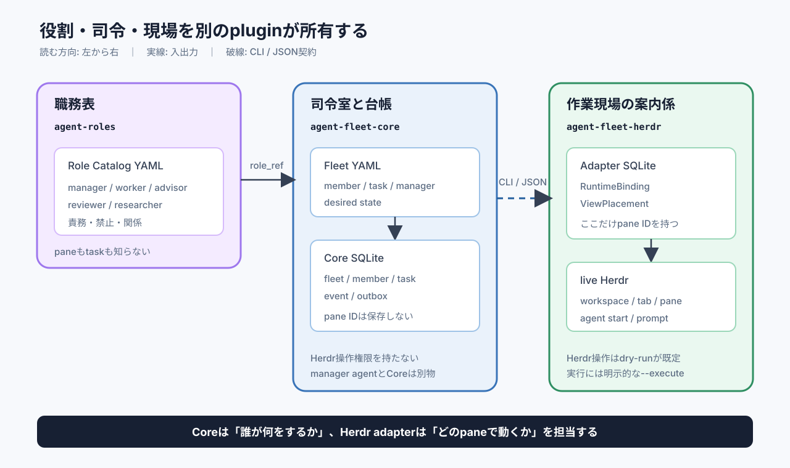
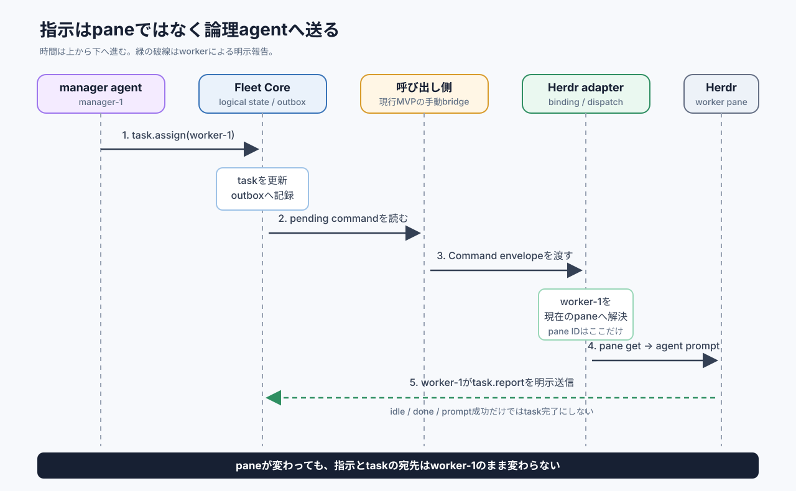

# エージェント艦隊は「人」と「座席」を分ける

エージェント艦隊は、役割を持つ「人」と、Herdr上の「座席」を別々に管理する仕組みである。

## 概要

> 艦隊の正体は、YAMLで決めたチームをCoreが管理し、Herdr adapterがpaneへ座らせる仕組みである。

**最初に覚えることは、agentとpaneが同じものではないという一点である。** `manager-1`は仕事を担う論理agentである。`pane-42`は、そのagentが現在使っている座席にすぎない。

### まず3つだけ覚える

**3つのpluginは、会社の「職務表」「司令室」「作業現場」に相当する。** 役割を分けたため、Herdrを使わない利用者は現場を動かす権限を入れずに済む。

| plugin | たとえ | 決めること | 決めないこと |
|---|---|---|---|
| `agent-roles` | 職務表 | manager、workerなどの責務と禁止事項 | 艦隊の人数、task、pane |
| `agent-fleet-core` | 司令室と台帳 | member、task、指示、報告、履歴 | paneの分割やHerdr操作 |
| `agent-fleet-herdr` | 作業現場の案内係 | paneの作成、配置、起動、指示の配送 | roleやtaskの意味 |

**役割・司令・現場の境界は、次の構成になる。** 矢印は利用する向きを表し、破線はplugin間のCLI/JSON契約を表す。

*図1: Coreはpane IDを知らない。Herdr固有の情報はHerdr adapterだけが持つ。*

### YAMLは注文書、SQLiteは現在の台帳

**YAMLには「どうしたいか」だけを書く。** たとえばmanagerを1体、workerを2体にすることや、誰へどのtaskを渡すかを宣言する。この変更頻度の低い希望を`desired state`と呼ぶ。

**SQLiteには「最後に記録・確認できた状態」を保存する。** CoreのSQLiteは論理agent、task、event、outboxを持つ。Herdr adapterのSQLiteはpaneとの対応と画面上の配置を持つ。この記録を`observed state`と呼ぶが、live Herdrと一時的にずれることはある。

| 保存先 | 代表例 | pane IDを持つか |
|---|---|---:|
| Fleet YAML | `manager-1`、`worker-1`、task、`command-deck` | 持たない |
| Core SQLite | taskの状態、event、未配送command | 持たない |
| Herdr adapter SQLite | `RuntimeBinding`、`ViewPlacement` | 持つ |

**保存場所を分けると、paneを閉じても仕事の意味は消えない。** 座席が壊れても、誰が何を担当していたかはCoreに残る。

### managerの指示はどう届くか

**managerはpane番号ではなく、`worker-1`のような論理IDへ指示する。** Coreは型付きcommandをoutboxへ積む。現行MVPでは、呼び出し側がそのcommandをHerdr adapterへ渡す。adapterは現在のpaneを解決してからpromptを届ける。

**指示の配送は、次の順に責務の境界を越える。** 上から下へ時間が進み、戻り矢印は明示的な作業報告を表す。

*図2: 指示の宛先は最後まで`worker-1`であり、pane IDはadapter内部でだけ使う。*

配送後も、Herdrの`idle`や`done`だけでtask完了とは判定しない。**taskを完了できるのは、割り当てられたagentによる明示的な`task.report`だけである。** 画面の見え方と業務上の完了を混同しないためである。

### UIはどう分割されるか

**現在の`command-deck`はmanagerを左約32%、workerを右側へ置く。** managerは左のpaneから全体を見て、右側のworkerへ論理IDで指示する。配置は人間が確認しやすくするための表示であり、指示の宛先ではない。

MVPはmanager 1体とworker 1〜4体を同じcommand-deckへ置く。現在のFleet例はmanager 1体とworker 2体である。5体以上のmemberを複数tabへ分ける案は設計上の拡張であり、現行MVPには含まれない。

## なぜこうなっているか

**人を座席番号で呼ぶ設計は、席替えに弱い。** paneは閉じられ、移動し、作り直される。`pane-42`をagentの正体にすると、paneが変わるたびにtaskと指示先まで壊れる。

`agent_ref`を社員番号、`pane_id`を座席番号と考えると分かりやすい。社員が別の席へ移っても、社員番号と担当taskは変わらない。Herdr adapterが社員番号と新しい座席を`RuntimeBinding`で結び直す。

**CoreとHerdr adapterの分離は、変更と権限の波及を止める。** HerdrのCLIやpane配置が変わっても、roleやtaskのルールは変えない。Coreだけを使う環境には、paneを作成・操作する権限を入れない。

manager agentはCoreそのものではない。managerが停止しても、Core SQLiteの論理状態は残る。また、role YAMLの権限はcommand受付とprompt上の規律であり、OSやshell全体をsandbox化する仕組みではない。

**安全側へ倒す規則も境界ごとに決めている。** 現行MVPは次の4規則を採る。

- `provision`はdry-runが既定であり、`--execute`を明示した場合だけHerdrを変更する。
- paneを失ったら`lost`にし、自動再作成や自動再bindをしない。
- promptのtimeoutは`unknown`にし、重複実行を避けるため自動再送しない。
- task完了はagentが明示報告し、Herdrの表示状態から推測しない。

**この構造は、壊れないことより、壊れた場所を限定して分かることを優先する。** Coreの台帳、adapterの座席表、Herdrの実行場所を分けたため、復旧時に見る場所が決まる。現行の`fleet.reconcile`は状態を読み出す操作であり、自動修復する常駐controllerではない。

## 採らなかった選択肢

| 選択肢 | 採らなかった理由 |
|---|---|
| pane IDをagent IDにする | paneの移動・削除でtaskの宛先まで壊れる |
| role、Core、Herdrを1つの巨大pluginにする | roleだけ欲しい利用者にもHerdr操作権限と依存が入る |
| CoreとHerdr adapterを1つのinstallable pluginにする | Coreだけ使う利用者へHerdr操作権限を隔離できない |
| managerが全状態をprompt内で覚える | 再起動後にtask、履歴、未配送commandを再現できない |
| Herdrの`idle`や`done`でtaskを完了する | 実行停止と完了条件の達成は同じ事実ではない |
| timeout時に自動再送する | 最初のpromptが届いていた場合に作業を二重実行する |
| 消えたpaneを自動で作り直す | 人間の作業や別のpaneを誤って置き換える危険がある |
| fleet同士が相手のpaneへ直接送る | 相手の内部配置へ依存し、fleetの独立性がなくなる |

## 関連コンセプト

**似た名前の5要素は、同じものではない。** どれを変更しているかが分かれば、設計上の迷子にならない。

| 概念 | やさしい意味 | 正本 |
|---|---|---|
| `RoleDefinition` | 何をする人か | `agent-roles`のYAML |
| `AgentInstance` | 艦隊にいる誰か | Fleet YAMLとCore SQLite |
| `TaskAssignment` | その人が今する仕事 | Core SQLite |
| `RuntimeBinding` | その人が今いるpane | Herdr adapter SQLite |
| `ViewPlacement` | UI上の見せ方 | Herdr adapter SQLite |

実際の3体構成は[manager 1・worker 2のFleet YAML](../plugins/agent-fleet-core/spec/examples/fleet.example.yml)で確認できる。roleの実物は[別repositoryのrole catalog](../../agent-roles-plugins/plugins/agent-roles/roles/catalog.yml)にある。

詳しい判断理由は[設計RFC](../../agent-roles-plugins/docs/2026-08-30-agent-fleet-design.md)にある。実装入口は[Core skill](../plugins/agent-fleet-core/SKILL.md)と[Herdr skill](../plugins/agent-fleet-herdr/SKILL.md)である。

## その他の情報

**現在できているのは、local Herdrで小さな艦隊を安全に計画・管理するMVPである。** 44件のunit testとdry-run integrationは成功している。実環境を変更するHerdrの`--execute` provisionは、まだ検証していない。

### 動かす前に見る順番

1. Fleet YAMLでmember、task、managerを確認する。
2. Core validatorでnormalized JSONへ変換する。
3. Herdr adapterのdry-runでpane分割と起動commandを確認する。
4. 実環境へ反映するときだけ`--execute`を明示する。

詳細な入口とinstall方法は[repository README](../README.md)にある。**この資料を読み終えた時点では、「agentは人、paneは座席、Coreは台帳、Herdr adapterは座席係」と答えられれば十分である。**
