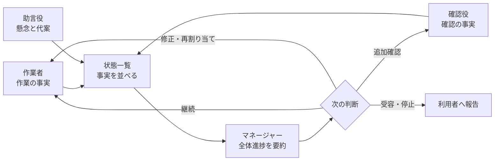
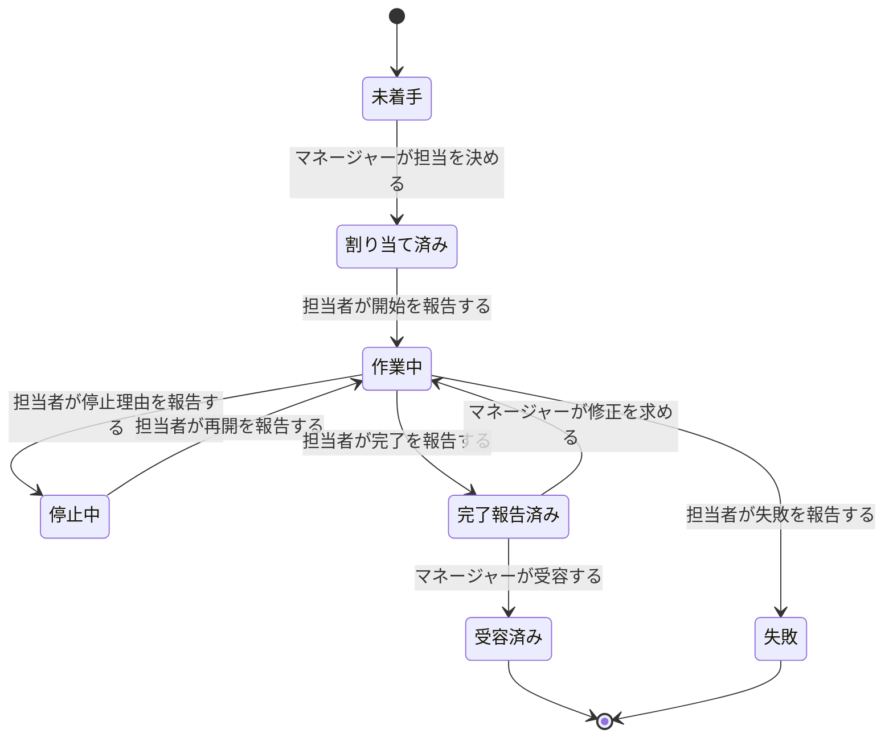

# エージェント艦隊における作業進行ルール

この資料は、エージェント艦隊で仕事を進めるときに、誰が何を報告し、誰が全体を要約し、誰が最終判断を行うかを定める。

> 作業者・確認役・助言役は担当範囲の事実を報告し、マネージャーはそれらを目的と完了条件に照らして全体進捗へ要約し、次の指示と受容を判断する。

## この資料が扱う範囲

**ここで扱うのは、役割Catalogで決まった責務を艦隊のタスク進行へ適用する決まりである。** 役割そのものの意味、兼任禁止、受容権限は`agent-roles`を正本とし、この資料では複製しない。保存方式、指示の配送、実行場所、待ち時間などの実現方法も扱わない。

| この資料で決めること | 別資料で決めること |
|---|---|
| 役割ごとの責務 | 指示と報告が届く仕組み |
| 作業報告に必要な内容 | Core、SQLite、Herdrの責務 |
| 全体進捗を要約する主体 | paneを持たない制御処理 |
| 完了・失敗・停止の判断 | 性能目標、復旧時間、計測方法 |

実現方法は[艦隊制御アーキテクチャ](2026-08-31-エージェント艦隊-連携と全体制御.md)、性能と運用品質は[非機能要件](2026-08-31-エージェント艦隊-非機能要件.md)を正本とする。

## 用語

**特に「状態一覧」と「全体進捗要約」を分ける。**

| 用語 | 意味 |
|---|---|
| 艦隊 | 一つの目的を達成するために編成された役割の集まり |
| タスク | 担当、期待する成果、完了条件を持つ仕事の単位 |
| 作業報告 | 担当者が、自分の担当範囲で起きた事実を伝えること |
| 確認結果 | 確認役が、成果物と完了条件の一致・不一致を伝えること |
| 助言 | 助言役が、懸念、代案、判断材料を伝えること |
| 状態一覧 | 各タスクの状態と報告を、意味を付け足さず並べたもの |
| 全体進捗要約 | マネージャーが目的、完了条件、停止条件に照らして報告群を解釈したもの |
| 受容 | 成果が完了条件を満たしたとマネージャーが認めること |
| 進捗不明 | 報告期限を過ぎ、現在の事実を判断できない状態 |
| 役割文脈 | 艦隊の目的、自身の役割、担当、完了条件、停止条件、報告先を一つにした現在情報 |

## 艦隊を構成する役割

**標準部隊は、マネージャー1体、作業者2体、助言役1体、確認役1体で構成する。** 人数を変えても責務の境界は変えない。

| 役割 | 責務 | 報告先 | 行わないこと |
|---|---|---|---|
| マネージャー | 目的・完了条件・停止条件を保持し、担当を決め、全体進捗を要約し、継続・停止・再割り当て・受容を判断する | 利用者 | 担当者の報告を推測で補う、配送作業を直接担う |
| 作業者 | 割り当てられた成果物を作り、節目・停止・再開・完了・失敗を報告する | マネージャー | 他の作業者の担当を変更する、全体完了を決める |
| 助言役 | 設計上の懸念、代案、判断材料を報告する | マネージャー | 最終案を決める、タスクを受容する |
| 確認役 | 成果物と完了条件を照合し、一致、不一致、未確認範囲を報告する | マネージャー | 作業者の完了報告を代行する、全体完了を決める |

## 報告から判断までの責務

**事実を作る役割、事実を並べる役割、意味を要約する役割を分ける。** マネージャーだけが全体の目的と完了条件を持つため、全体進捗の意味づけもマネージャーが担う。



状態一覧は、事実の欠落や期限超過を示せるが、「順調」「完了可能」「方針変更が必要」といった意味判断を作らない。マネージャーは、目的に対する影響と次に必要な判断を含む全体進捗要約を作る。

## 業務ルール

### マネージャーが全体を統括する

**マネージャーは、目的、完了条件、停止条件、現在の担当、未解決事項を一貫して保持する。**

- タスクの担当を決められるのはマネージャーである。
- 全体進捗要約を作るのはマネージャーである。
- 成果を受容し、艦隊の作業完了を決めるのはマネージャーである。
- 停止条件に達したと判断し、作業を止めるのはマネージャーである。

### メンバーは現在の役割文脈で行動する

**各メンバーは、現在の役割文脈を確認してから新しい仕事を開始する。** 担当変更によって役割文脈が改訂された場合、以前に確認した内容だけでは新しい仕事を開始できない。

- 役割文脈の正本は艦隊の論理状態であり、会話履歴や個々の記憶ではない。
- 役割文脈には改訂番号を付け、古い改訂で現在情報を巻き戻さない。
- 会話を分岐しても同じメンバーが複製されたとは扱わず、分岐先は改めて役割文脈を確認する。
- 役割文脈を確認できない間は作業を開始せず、既存の担当と報告を失わない。
- 割り当て済み、停止中、差し戻し中の仕事について開始または再開を報告しても、目的、役割、担当、完了条件、停止条件、報告先は変わらない。役割文脈を改訂せず、進行中の仕事へ新しい同期を割り込ませない。再開理由や修正内容は状態変更へ暗黙に含めず、マネージャーが新しい指示として示す。

### 担当者は自分の担当範囲を報告する

**報告は、観測した本人が、自分の担当範囲について行う。** 他者の推測や作業枠の見た目は、作業報告の代わりにならない。

作業者は少なくとも、作業開始、完了条件に関係する節目、判断材料の変化、停止、再開、完了、失敗の各時点で報告する。

作業報告には、現在の状態、完了した節目、現在行っていること、成果物、停止理由、未確認範囲を含める。完了報告と失敗報告を除き、次回報告予定も必須とする。

### 報告と完了を分ける

**報告が届いたことは、タスクの完了を意味しない。** 作業者の完了報告、確認役の確認結果、完了条件をマネージャーが合わせて判断し、受容した時点で全体の完了が決まる。



### 報告期限超過は失敗ではない

**次回報告予定を過ぎても報告がない場合、進捗は不明になるが、タスクは自動で失敗にも完了にもならない。** マネージャーが状況確認、待機、再割り当て、停止のいずれかを判断する。

一回目の期限超過では、マネージャーが状況確認を行う。二回続けて期限を過ぎた場合は、マネージャーだけで待機を継続せず、継続、再割り当て、停止の判断を利用者へ求める。

### 同じ報告を二重に数えない

**同じ報告が再び届いても、進捗上の出来事は一度だけとして扱う。** 再送によって完了した節目、確認結果、未解決事項の件数を増やさない。

### マネージャーが不在でも報告を失わない

**マネージャーが一時的に応答できなくても、各役割は報告を残せる。** マネージャーは復帰後に未確認の報告を読み、全体進捗の要約と判断を再開する。

### 独立確認が必要な成果を分ける

**権限、保持データ、並行処理、外部との通信、または複数の利用経路へ影響する成果は、確認役の独立確認を受ける。** それ以外の成果でも、完了条件に独立確認が明記されていれば同じ扱いとする。必要な確認結果がない成果を、マネージャーは受容しない。

### 失敗後の再試行を明示する

**失敗したタスクは自動で再開しない。** マネージャーが失敗理由と変更点を示して新しい試行を割り当てる。同じタスクの試行は三回までとし、三回目も失敗した場合は、範囲変更、別担当、停止の判断を利用者へ求める。

## 代表的な振る舞い

```gherkin
Scenario: マネージャーが未着手タスクの担当を決める
  Given マネージャーMは艦隊Fのマネージャーである
  And 作業者Wは艦隊Fのメンバーである
  And タスクTは未着手である
  When マネージャーMがタスクTを作業者Wへ割り当てる
  Then タスクTの担当は作業者Wになる
  And 作業者WはタスクTの指示を確認できる
```

```gherkin
Scenario: 作業者は他者へタスクを割り当てられない
  Given 作業者W1は艦隊Fのマネージャーではない
  And 作業者W2は艦隊Fのメンバーである
  And タスクTは未着手である
  When 作業者W1がタスクTを作業者W2へ割り当てる
  Then タスクTの担当は決まらない
  And タスクTは未着手のまま維持される
NOTE:
  Rule: マネージャーが全体を統括する
  Reason: 作業者W1は担当を決めるマネージャーではないため
```

```gherkin
Scenario: 作業者の節目報告をマネージャーが確認できる
  Given タスクTは作業者Wへ割り当てられている
  And 作業者WはタスクTを作業中である
  When 作業者WがタスクTの節目と次回報告予定を報告する
  Then マネージャーMはタスクTの節目報告を確認できる
  And タスクTは作業中のまま維持される
```

```gherkin
Scenario: 担当ではない作業者の報告でタスク状態を変えない
  Given タスクTは作業者Wへ割り当てられている
  And 作業者XはタスクTの担当ではない
  When 作業者XがタスクTの完了を報告する
  Then タスクTの完了報告は成立しない
  And タスクTの状態は変わらない
NOTE:
  Rule: 担当者は自分の担当範囲を報告する
  Reason: 作業者XはタスクTを報告できる担当者ではないため
```

```gherkin
Scenario: マネージャーが各役割の報告から全体進捗を要約する
  Given マネージャーMは艦隊Fの目的を保持している
  And マネージャーMは艦隊Fの完了条件を保持している
  And 作業者Wの作業報告がある
  And 確認役Vの確認結果がある
  When マネージャーMが艦隊Fの進捗を確認する
  Then マネージャーMは目的と完了条件に対する全体進捗を要約する
  And マネージャーMは次に必要な判断を示す
```

```gherkin
Scenario: 作業者の完了報告だけではタスクを受容しない
  Given タスクTは作業者Wによって作業中である
  And マネージャーMはタスクTを受容していない
  When 作業者WがタスクTの完了を報告する
  Then タスクTは完了報告済みになる
  And タスクTは受容済みにならない
```

```gherkin
Scenario: 同じ節目報告を二重に数えない
  Given タスクTは作業者Wによって作業中である
  And 作業者Wの節目報告Rはすでに受け付けられている
  When 作業者Wが同じ節目報告Rを再び行う
  Then タスクTの節目報告Rは一件のまま維持される
```

```gherkin
Scenario: 報告予定を二回続けて過ぎたタスクを利用者判断へ上げる
  Given タスクTは作業者Wによって作業中である
  And 作業者Wは二回続けて次回報告予定を過ぎている
  And 作業者Wから完了報告はない
  And 作業者Wから失敗報告はない
  When 報告予定を二回続けて過ぎたことが確認される
  Then タスクTは作業中のまま維持される
  And マネージャーMは継続判断を利用者へ求める
```

```gherkin
Scenario: 一回目の報告予定超過では担当者へ状況確認を求める
  Given タスクTは作業者Wによって作業中である
  And 作業者Wの最新の次回報告予定を過ぎている
  And 直前の報告予定は守られている
  When 一回目の報告予定超過が確認される
  Then タスクTは作業中のまま維持される
  And 作業者Wへ状況確認が一度だけ求められる
  And 利用者へ継続判断は求められない
```

```gherkin
Scenario: 次回報告予定と同じ時刻の確認は期限超過にしない
  Given タスクTは作業者Wによって作業中である
  And 作業者Wの次回報告予定は時刻Dである
  When 時刻DにタスクTの報告予定が確認される
  Then タスクTの報告予定超過回数は増えない
  And 作業者Wへ状況確認は求められない
```

```gherkin
Scenario: 期限内の報告によって連続超過を解消する
  Given タスクTは作業者Wによって作業中である
  And 作業者Wは直前の報告予定を過ぎていた
  And 作業者Wは新しい次回報告予定を期限内に報告している
  When 作業者Wの新しい報告が受け付けられる
  Then タスクTの連続した報告予定超過は解消される
  And 利用者へ継続判断は求められない
```

```gherkin
Scenario: マネージャー不在中の報告を復帰後に確認する
  Given タスクTは作業者Wによって作業中である
  And マネージャーMは一時的に報告を確認できない
  When 作業者WがタスクTの節目と次回報告予定を報告する
  Then 作業者Wの報告は失われずに残る
  And マネージャーMは復帰後に未確認の報告を確認できる
```

```gherkin
Scenario: マネージャーだけが完了報告済みタスクを受容する
  Given タスクTは完了報告済みである
  And 作業者WはタスクTの担当者である
  When 作業者WがタスクTを受容しようとする
  Then タスクTは受容済みにならない
  And タスクTは完了報告済みのまま維持される
NOTE:
  Rule: マネージャーが全体を統括する
  Reason: 作業者Wは成果を受容するマネージャーではないため
```

```gherkin
Scenario: 差し戻されたタスクを担当者が再開する
  Given タスクTは作業者Wによって完了報告済みである
  And マネージャーMは完了条件との不一致を示している
  When 作業者WがタスクTの再開を報告する
  Then タスクTは作業中になる
  And タスクTの担当は作業者Wのまま維持される
  And 作業者Wの役割文脈の改訂番号は変わらない
```

```gherkin
Scenario: 作業開始報告で進行中の仕事へ役割同期を割り込ませない
  Given 作業者Wは現在の役割文脈を確認している
  And タスクTは作業者Wへ割り当て済みである
  When 作業者WがタスクTの開始を報告する
  Then タスクTは作業中になる
  And 作業者Wの役割文脈の改訂番号は変わらない
  And 作業者Wは役割同期に中断されずタスクTを続けられる
```

```gherkin
Scenario: 停止後に再開する仕事へ役割同期を割り込ませない
  Given 作業者Wは現在の役割文脈を確認している
  And タスクTは停止中である
  And タスクTの目的・担当・完了条件は変更されていない
  When 作業者WがタスクTの再開を報告する
  Then タスクTは作業中になる
  And 作業者Wの役割文脈の改訂番号は変わらない
  And 作業者Wは役割同期に中断されずタスクTを続けられる
```

```gherkin
Scenario: 依存する仕事は前のタスクが受容された後に始められる
  Given タスクUはタスクTの受容に依存している
  And タスクTは完了報告済みである
  And タスクUは未着手である
  When マネージャーMがタスクTを受容する
  Then タスクTは受容済みになる
  And タスクUは担当者へ割り当てられる
```

```gherkin
Scenario: マネージャーが未受理の依存タスクを手動で割り当てようとする
  Given タスクUは宣言順にタスクT1とタスクT2へ依存している
  And タスクT1はpendingである
  And タスクT2はreportedである
  When マネージャーMがタスクUを手動で割り当てる
  Then Coreは同じtransaction内で全依存タスクを確認する
  And CoreはT1とT2のIDおよび未受理状態を含むエラーで拒否する
  And タスクUはpendingのままである
```

```gherkin
Scenario: マネージャーが状態一覧だけで依存関係を監視する
  Given タスクUは宣言順にタスクT1とタスクT2へ依存している
  And タスクT1とタスクT2は受容済みである
  When マネージャーMがtask.listを実行する
  Then タスクUのdepends_onは["T1", "T2"]である
  And 依存しないタスクのdepends_onは空配列である
  And タスクT1とタスクT2の受容後も依存関係は表示される
```

## 成果物レビューの順序

workerは成果物と検証結果を`task.report`で`reported`としてmanagerへ届ける。reviewerはこの報告を入力として直ちにレビューし、workerの`accepted`を待たない。managerはworker報告とreview結果を照合した後だけ`task.accept`する。したがってreviewerをworkerの`depends_on`に置いて受入後まで解放しない設計は使わない。

```gherkin
Scenario: 失敗したタスクを自動で再開しない
  Given タスクTは作業者Wによって失敗報告済みである
  And マネージャーMは新しい試行を割り当てていない
  When マネージャーMが艦隊Fの進捗を確認する
  Then タスクTは失敗のまま維持される
  And 作業者WはタスクTを自動で再開しない
```

```gherkin
Scenario: 現在の役割文脈を確認していないメンバーへ新しい仕事を開始させない
  Given メンバーWは艦隊Fのメンバーである
  And メンバーWは現在の役割文脈を確認していない
  When マネージャーMがメンバーWへ新しい仕事の開始を求める
  Then メンバーWの新しい仕事は開始されない
NOTE:
  Rule: メンバーは現在の役割文脈で行動する
  Reason: メンバーWが現在の役割と担当を確認した事実がないため
```

## 確定した運用判断

- 完了報告と失敗報告を除く作業報告には、次回報告予定を必須とする。
- 報告予定の一回目の超過は状況確認、二回連続の超過は利用者への判断依頼とする。
- 権限、保持データ、並行処理、外部通信、複数利用経路へ影響する成果には独立確認を必須とする。
- 失敗したタスクはマネージャーの明示判断でのみ再試行し、三回失敗した後は利用者判断へ移す。
- 全体進捗の意味づけと要約はマネージャーだけが行い、機械処理は事実の一覧化に留める。
- 現在の役割文脈を確認できないメンバーへ、新しい仕事を開始させない。

## 関連資料

- [艦隊制御アーキテクチャ](2026-08-31-エージェント艦隊-連携と全体制御.md) — 指示、報告、状態一覧をどの構成要素が運ぶか
- [非機能要件](2026-08-31-エージェント艦隊-非機能要件.md) — 待ち時間、並行実行、復旧、計測の基準
- [役割Hookの実行契機と責務](2026-09-01-エージェント艦隊-役割Hookの実行契機と責務.md) — 現在の役割文脈を会話へ戻し、指示を検査する時点
- [現在の艦隊定義例](../configs/fleets/release-readiness.yml) — マネージャー1体と作業者2体の利用者設定例
