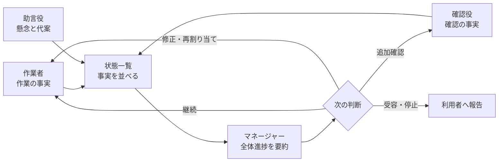
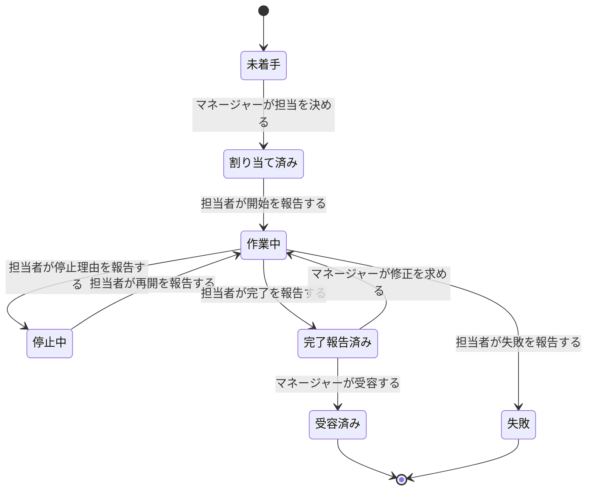

# エージェント艦隊における作業進行ルール

この資料は、エージェント艦隊で仕事を進めるときに、誰が何を報告し、誰が全体を要約し、誰が最終判断を行うかを定める。

> 作業者・確認役・助言役は担当範囲の事実を報告し、マネージャーはそれらを目的と完了条件に照らして全体進捗へ要約し、次の指示と受容を判断する。

## この資料が扱う範囲

**ここで扱うのは、艦隊の作業進行に関する判断の決まりである。** 保存方式、指示の配送、実行場所、待ち時間などの実現方法は扱わない。

| この資料で決めること | 別資料で決めること |
|---|---|
| 役割ごとの責務 | 指示と報告が届く仕組み |
| 作業報告に必要な内容 | Core、SQLite、Herdrの責務 |
| 全体進捗を要約する主体 | paneを持たない制御処理 |
| 完了・失敗・停止の判断 | 性能目標、復旧時間、計測方法 |

実現方法は[艦隊制御アーキテクチャ](2026-08-31-エージェント艦隊-連携と全体制御.md)、性能と運用品質は[非機能要件](2026-08-31-エージェント艦隊-非機能要件.md)を正本とする。

## 用語

**特に「状態一覧」と「全体進捗要約」を分ける。**

| 用語 | 意味 |
|---|---|
| 艦隊 | 一つの目的を達成するために編成された役割の集まり |
| タスク | 担当、期待する成果、完了条件を持つ仕事の単位 |
| 作業報告 | 担当者が、自分の担当範囲で起きた事実を伝えること |
| 確認結果 | 確認役が、成果物と完了条件の一致・不一致を伝えること |
| 助言 | 助言役が、懸念、代案、判断材料を伝えること |
| 状態一覧 | 各タスクの状態と報告を、意味を付け足さず並べたもの |
| 全体進捗要約 | マネージャーが目的、完了条件、停止条件に照らして報告群を解釈したもの |
| 受容 | 成果が完了条件を満たしたとマネージャーが認めること |
| 進捗不明 | 報告期限を過ぎ、現在の事実を判断できない状態 |

## 艦隊を構成する役割

**標準部隊は、マネージャー1体、作業者2体、助言役1体、確認役1体で構成する。** 人数を変えても責務の境界は変えない。

| 役割 | 責務 | 報告先 | 行わないこと |
|---|---|---|---|
| マネージャー | 目的・完了条件・停止条件を保持し、担当を決め、全体進捗を要約し、継続・停止・再割り当て・受容を判断する | 利用者 | 担当者の報告を推測で補う、配送作業を直接担う |
| 作業者 | 割り当てられた成果物を作り、節目・停止・再開・完了・失敗を報告する | マネージャー | 他の作業者の担当を変更する、全体完了を決める |
| 助言役 | 設計上の懸念、代案、判断材料を報告する | マネージャー | 最終案を決める、タスクを受容する |
| 確認役 | 成果物と完了条件を照合し、一致、不一致、未確認範囲を報告する | マネージャー | 作業者の完了報告を代行する、全体完了を決める |

## 報告から判断までの責務

**事実を作る役割、事実を並べる役割、意味を要約する役割を分ける。** マネージャーだけが全体の目的と完了条件を持つため、全体進捗の意味づけもマネージャーが担う。



状態一覧は、事実の欠落や期限超過を示せるが、「順調」「完了可能」「方針変更が必要」といった意味判断を作らない。マネージャーは、目的に対する影響と次に必要な判断を含む全体進捗要約を作る。

## 業務ルール

### マネージャーが全体を統括する

**マネージャーは、目的、完了条件、停止条件、現在の担当、未解決事項を一貫して保持する。**

- タスクの担当を決められるのはマネージャーである。
- 全体進捗要約を作るのはマネージャーである。
- 成果を受容し、艦隊の作業完了を決めるのはマネージャーである。
- 停止条件に達したと判断し、作業を止めるのはマネージャーである。

### 担当者は自分の担当範囲を報告する

**報告は、観測した本人が、自分の担当範囲について行う。** 他者の推測や作業枠の見た目は、作業報告の代わりにならない。

作業者は少なくとも、作業開始、完了条件に関係する節目、判断材料の変化、停止、再開、完了、失敗の各時点で報告する。

作業報告には、現在の状態、完了した節目、現在行っていること、成果物、停止理由、未確認範囲、次回報告予定のうち、判断に必要なものを含める。

### 報告と完了を分ける

**報告が届いたことは、タスクの完了を意味しない。** 作業者の完了報告、確認役の確認結果、完了条件をマネージャーが合わせて判断し、受容した時点で全体の完了が決まる。



### 報告期限超過は失敗ではない

**次回報告予定を過ぎても報告がない場合、進捗は不明になるが、タスクは自動で失敗にも完了にもならない。** マネージャーが状況確認、待機、再割り当て、停止のいずれかを判断する。

### 同じ報告を二重に数えない

**同じ報告が再び届いても、進捗上の出来事は一度だけとして扱う。** 再送によって完了した節目、確認結果、未解決事項の件数を増やさない。

### マネージャーが不在でも報告を失わない

**マネージャーが一時的に応答できなくても、各役割は報告を残せる。** マネージャーは復帰後に未確認の報告を読み、全体進捗の要約と判断を再開する。

## 代表的な振る舞い

```gherkin
Scenario: 作業者の節目報告をマネージャーが確認できる
  Given タスクTは作業者Wへ割り当てられている
  And 作業者WはタスクTを作業中である
  When 作業者WがタスクTの節目を報告する
  Then マネージャーMはタスクTの節目報告を確認できる
  And タスクTは作業中のまま維持される
```

```gherkin
Scenario: マネージャーが各役割の報告から全体進捗を要約する
  Given マネージャーMは艦隊Fの目的と完了条件を保持している
  And 作業者Wの作業報告がある
  And 確認役Vの確認結果がある
  And 助言役Aの助言がある
  When マネージャーMが艦隊Fの進捗を確認する
  Then マネージャーMは目的と完了条件に対する全体進捗を要約する
  And マネージャーMは次に必要な判断を示す
```

```gherkin
Scenario: 報告期限を過ぎてもタスクを失敗にしない
  Given タスクTは作業者Wによって作業中である
  And 作業者Wの次回報告予定を過ぎている
  And 作業者Wから完了報告はない
  And 作業者Wから失敗報告はない
  When マネージャーMがタスクTの進捗を確認する
  Then タスクTは作業中のまま維持される
  And タスクTの進捗は不明として扱われる
```

```gherkin
Scenario: 担当ではない作業者の報告でタスク状態を変えない
  Given タスクTは作業者Wへ割り当てられている
  And 作業者XはタスクTの担当ではない
  When 作業者XがタスクTの完了を報告する
  Then タスクTの完了報告は成立しない
  And タスクTの状態は変わらない
NOTE:
  Rule: 業務ルール > 担当者は自分の担当範囲を報告する
  Reason: 作業者XはタスクTを報告できる担当者ではないため
```

```gherkin
Scenario: 同じ節目報告が再び届いても進捗上の出来事を増やさない
  Given タスクTは作業者Wによって作業中である
  And 作業者Wの節目報告Rはすでに受け付けられている
  When 作業者Wが同じ節目報告Rを再び行う
  Then タスクTの節目報告Rは一件のまま維持される
```

```gherkin
Scenario: マネージャー不在中の報告を復帰後に確認できる
  Given タスクTは作業者Wによって作業中である
  And マネージャーMは一時的に応答できない
  When 作業者WがタスクTの節目を報告する
  Then 作業者Wの節目報告は残る
  And マネージャーMは復帰後に節目報告を確認できる
```

## 未回答の問い

**次の項目は業務判断が未確定である。** 実装上の既定値で決めず、マネージャー役の運用責任者が決める。

- タスクごとの次回報告予定を必須にするか
- 報告期限超過が何回続いたら利用者へ判断を求めるか
- 確認役の確認を必須にする成果物の条件は何か
- 失敗報告後に同じ担当者が再開できる条件は何か

## 関連資料

- [艦隊制御アーキテクチャ](2026-08-31-エージェント艦隊-連携と全体制御.md) — 指示、報告、状態一覧をどの構成要素が運ぶか
- [非機能要件](2026-08-31-エージェント艦隊-非機能要件.md) — 待ち時間、並行実行、復旧、計測の基準
- [現在の艦隊定義例](../plugins/agent-fleet-core/spec/examples/fleet.example.yml) — マネージャー1体と作業者2体の宣言例
