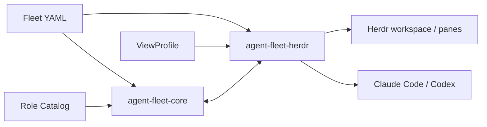

# エージェント艦隊の連携と全体制御

この資料は、Fleet YAML、Role Catalog、ViewProfile、Core、Herdr Adapterの責務と連携を定める。利用手順は[README](../README.md)を正本とする。

## 構成



- Fleet YAMLは目的、完了条件、停止条件、member、task、manager、各memberの起動条件を持つ。
- Role Catalogはroleの使命、責任、権限、禁止事項を持つ。Fleetは版付き`role_ref`だけを持つ。
- ViewProfileはmemberをpaneへ割り当てる規則、列のweight、列内の分割方向、対応人数を持つ。
- Coreは論理agent、task、report、command、event、受入状態をSQLiteで管理する。
- Herdr Adapterはworkspace、pane binding、配置、agent起動、指示配送を管理する。

## Fleet YAML

Fleet YAMLは任意のdirectoryへ置ける。起動時は絶対パスで指定する。

各memberの`runtime`は次を必須とする。

- `product`: `claude`または`codex`
- `command`: 対話shellで解決できるコマンド名、wrapper、alias、または実行ファイルの絶対パス
- `model`: 選択するモデルID
- `effort`: 思考量
- `fallback`: モデルを利用できない場合の扱い

`spec.view_profile`は任意である。省略時はplugin内の既定ViewProfileを使う。指定時はViewProfileの絶対パスだけを受理し、相対パス、`~`、環境変数による省略は拒否する。

### Fleet設定ファイルパス検査の宣言

```text
正本: fleet.schema.ymlのspec.view_profileと本節
入力: 検査対象Fleet YAMLのspec.view_profile
正規化: 文字列を展開せずに読み、~や環境変数を展開しない
合格述語: spec.view_profileが省略されているか、/から始まる絶対パスである
失敗時の診断: spec.view_profileと「must be an absolute path」を示す
正例: /absolute/path/to/view-profile.yml
反例: ./view-profile.yml、view-profiles/view-profile.yml
境界例: 省略は既定ViewProfileを使うため合格。~/view-profile.ymlと$HOME/view-profile.ymlは不合格
意味評価として残す範囲: 指定先が目的に適う配置か、選んだViewProfileが利用者の意図に合うか
```

絶対パスの実在、通常fileであること、symlinkでないことはHerdr Adapterがstate作成前に検査する。

## 起動シーケンス

1. `fleet-runtime`が絶対パスのFleet YAMLを読み、CoreでschemaとRole Catalog参照を検査する。
2. ViewProfileを解決し、member数、role selector、一意なpane割当、weightを検査する。
3. 各memberの`command`、製品、認証、必要なplugin、Core・Herdr・Hookを事前検査する。
4. 検査した実行物と設定を内容hash付きで固定する。
5. Herdr workspaceを作り、ViewProfileから決定的にpaneをsplitする。
6. 各paneでFleetに記載されたcommand、model、effortを使ってagentを起動する。
7. Herdrから実際のlayoutを取得し、期待配置と完全に照合する。
8. 検査成功後だけpane bindingとplacementを保存し、配送制御を開始する。

## 実行時の配置検査

起動成功には次のすべてが必要である。

- Fleet member数とpane数が一致する。
- 全memberが異なるpane IDへ一対一で対応する。
- workspace IDとtab IDが作成結果に一致する。
- paneの幅と高さが正で、表示領域の内側にある。
- pane同士に重なりや隙間がない。
- split数と方向がViewProfileから計算した値と一致する。
- 各paneのx、y、width、heightがsplit計画の期待矩形と一致する。
- split比率の結果が期待どおりかは、最終的なpane矩形の一致で検査する。

不一致時はbindingとplacementを保存せず、作成したworkspaceを閉じる。workspaceのcloseにも失敗した場合は、配置エラーとcleanupエラーを合わせて報告する。

## 指示と完了

managerがCoreへ型付きcommandを登録し、Herdr Adapterが対象`agent_ref`の現在のpaneへ配送する。HookはcommandのFleet、送信元、宛先、受信sessionを照合し、役割文脈を追加する。

paneの待機状態やagent processの終了はtask完了を意味しない。workerの明示報告とmanagerの受入によってtaskを完了させる。配送結果が不明な場合は自動再送せず、人間またはmanagerの判断を待つ。

## 状態と再実行

同じFleet、ViewProfile、作業directory、起動条件、固定実行物の内容hashが一致する再実行は冪等に扱う。起動中のFleetに異なる設定を暗黙適用しない。

`status`と`stop`はFleetの`metadata.id`を使う。`remove`は停止後の保存状態まで削除する操作である。

## 対象外

daemon化、複数host間の艦隊、艦隊間gateway、独自Web UI、消失paneの自動再作成は対象外とする。

## 関連資料

- [コンセプトと設計](concepts.md)
- [作業進行ルール](2026-08-31-エージェント艦隊-作業進行ルール.md)
- [非機能要件](2026-08-31-エージェント艦隊-非機能要件.md)
- [役割Hookの実行契機と責務](2026-09-01-エージェント艦隊-役割Hookの実行契機と責務.md)
