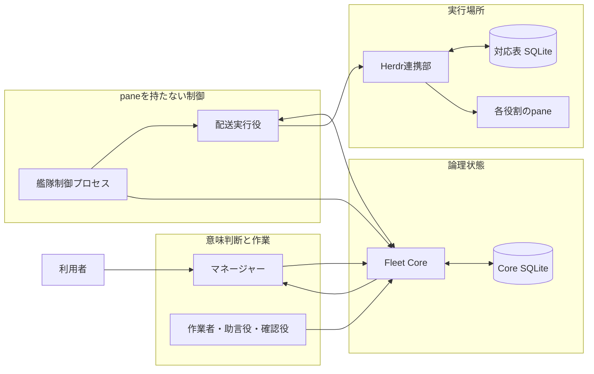
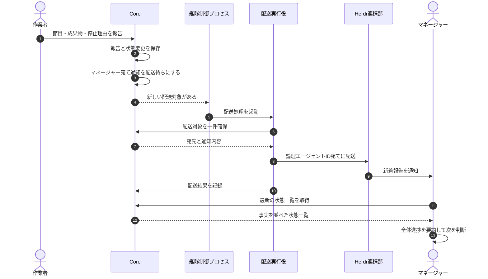
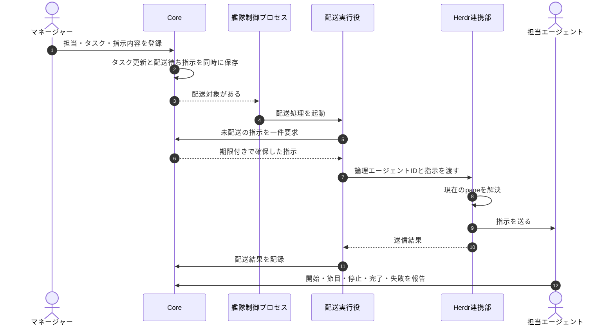
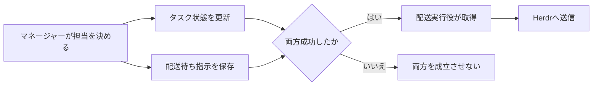
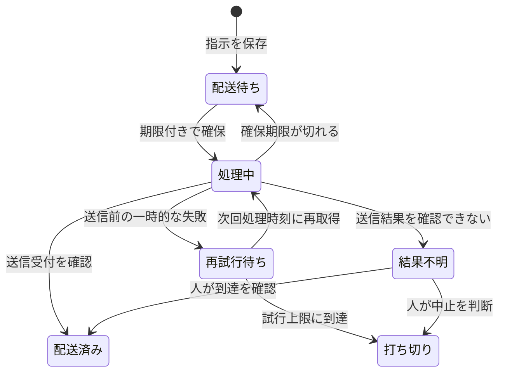
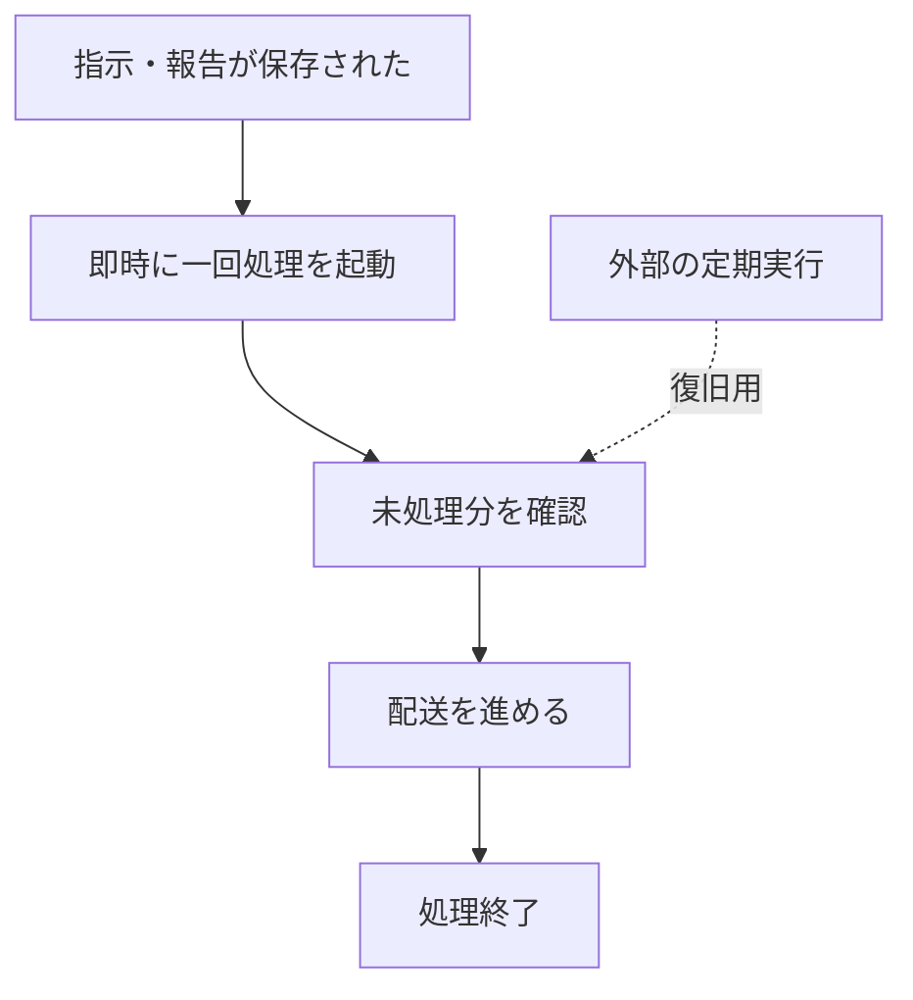
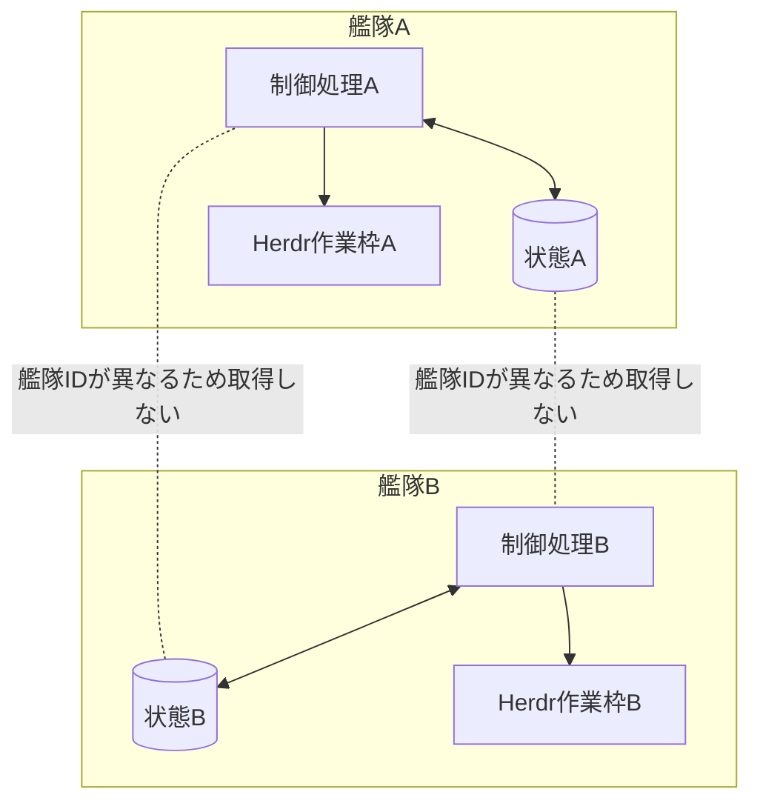

# エージェント艦隊の連携・全体制御

この資料は、指示・作業報告・確認結果・助言をどのように受け渡し、マネージャーが艦隊全体を監視できる状態を保つかを説明する。

> マネージャーは仕事の意味と最終判断を担い、Coreは事実を保存し、paneを持たない艦隊制御プロセスが未配送の指示と通知をHerdrへ流す。

## 目的

**マネージャーやHerdrが一時停止しても指示と報告を失わず、同じ状態から作業を再開できるようにする。** 同時に、機械的な配送と、目的に照らした意味判断を分離する。

この構成が解決する問題は次の四つである。

1. マネージャーの記憶だけでは、再起動後に担当、未完了作業、未確認報告を再現できない。
2. pane番号を担当者の識別子にすると、paneの作り直しで指示先が壊れる。
3. 指示を保存せず直接送ると、送信前の停止で指示が消える。
4. 配送処理に意味判断を持たせると、全体進捗を要約する主体が曖昧になる。

## 責務の境界

**全体制御は、意味判断、論理状態、配送制御、実行場所の四層に分ける。**

| 構成要素 | 担うこと | 担わないこと | pane |
|---|---|---|---|
| マネージャー | 目的、完了条件、停止条件、担当、全体進捗要約、最終判断 | SQLite巡回、配送順序、pane番号の解決 | 持つ |
| 作業者・確認役・助言役 | 担当範囲の実行と明示報告 | 全体進捗要約、他者の担当変更 | 持つ |
| Fleet Core | 艦隊、担当、タスク、報告、履歴、配送待ち指示の整合性と状態一覧 | Herdr操作、pane番号、報告の意味解釈 | 持たない |
| 艦隊制御プロセス | 配送対象と期限超過の検出、配送起動、復旧時の再確認 | 作業、要約、完了判断 | 持たない |
| 配送実行役 | Coreから配送対象を一件確保し、配送結果を返す | タスク判断、報告要約 | 持たない |
| Herdr連携部 | 論理エージェントと現在のpaneを対応づけ、指示を送る | タスクと完了条件の管理 | 持たない |
| Herdr | エージェントのローカル実行場所を提供する | 艦隊全体の正本になること | paneを提供する |



SQLiteを直接読むのは、それを所有する構成要素だけである。Herdr連携部はCore SQLiteを直接監視せず、Coreの公開された操作を通す。

## マネージャーはどう監視するか

**マネージャーはpaneの出力量ではなく、Coreに残った明示報告と状態一覧を読む。** 状態一覧は事実の並び替えと集計だけを行い、意味を付け足さない。

| 状態一覧の区分 | 内容 |
|---|---|
| 艦隊 | 艦隊ID、目的、最終更新時刻 |
| メンバー | 論理エージェントID、役割、稼働状態 |
| タスク | 担当、状態、最後の報告、次回報告予定 |
| 報告 | 節目、現在の作業、成果物、停止理由、未確認範囲 |
| 要確認 | 報告期限超過、配送結果不明、未受容の完了報告 |
| 配送 | 配送待ち、処理中、配送済み、結果不明、打ち切りの件数 |

マネージャーはこの一覧を目的・完了条件・停止条件に照らし、「順調」「修正が必要」「判断待ち」「停止すべき」といった全体進捗要約を作る。Coreと艦隊制御プロセスは、この意味判断を行わない。



## 指示を届ける流れ

**指示は先にCoreへ保存し、その後で配送する。** タスク更新と配送待ち指示を同じ処理で確定し、片方だけが残る状態を避ける。



配送成功は送信受付だけを表し、作業完了を表さない。作業完了は担当エージェントの明示報告で別に確定する。

## 配送待ち指示が果たす役割

**配送待ち指示は、状態変更と外部送信の間を切り離す。** 実装上のテーブル名は`outbox`だが、役割が分かるように本文では「配送待ち指示」と呼ぶ。

タスクを作業者へ割り当てるときは、次の二つを一度に保存する。

1. タスクの担当が決まった事実
2. その作業者へ届ける配送待ち指示

保存後にHerdrが停止しても両方が残るため、復旧後に未配送分を取得できる。マネージャーが同じ指示を作り直す必要はない。



「送信結果を確認できない」場合は、すでに届いた可能性があるため自動再送しない。

## 配送状態とタスク状態を分ける

**通信の成否と仕事の成否は別の状態である。**



配送失敗でタスクを自動失敗にせず、配送済みでタスクを自動完了にしない。

## paneを持たない艦隊制御プロセス

**艦隊制御プロセスはエージェントではなく、判断を持たないローカル処理である。** そのためpaneを割り当てない。

通常経路は指示や報告の保存を契機に一度だけ起動する。長時間動き続ける常駐処理をMVPの前提にしない。異常終了やOS休止で契機を取り逃した場合だけ、外部の定期実行から同じ一回処理を呼び出す。



通常時の待ち時間を定期実行間隔に依存させず、停止時の回収経路も残せる。

## 人がいつでも状態を確認する方法

**読み取り専用コマンドを使い、制御用paneは作らない。** 現行Coreでは次のコマンドを使う。

```bash
plugins/agent-fleet-core/core/scripts/fleet-control \
  --db <CoreのSQLiteファイル> \
  status \
  --fleet <艦隊ID>
```

現行コマンドはメンバー、タスク、未処理の配送待ち指示、履歴をJSONで返す。目標構成では、最後の報告、次回報告予定、配送状態の件数、報告期限超過も返す。

## 複数艦隊を同じ端末で動かす

**状態取得と配送対象の確保は、常に艦隊IDで範囲を限定する。** 別艦隊の指示を取得してはならない。



MVPは一台のMac内での複数艦隊を対象とする。別端末間でのSQLite共有、艦隊間の直接通信、独自Web UIは対象外である。

## 現在の実装と目標構成の差

**未実装部分を、現在自動で動いているものとして扱わない。**

| 項目 | 現在 | 目標 |
|---|---|---|
| 艦隊・メンバー・タスク・履歴の保存 | 実装済み | 維持 |
| 配送待ち指示 | 配送待ちと受領確認済みを実装済み | 期限付き確保、配送済み、結果不明、打ち切りへ拡張 |
| Herdrへの論理ID配送 | 実装済み | 配送実行役から利用 |
| 完了・失敗・停止の明示報告 | 実装済み | 節目報告と次回報告予定を追加 |
| 決定的な状態一覧 | 基本情報のみ実装済み | 報告、期限超過、配送集計を追加 |
| paneを持たない艦隊制御プロセス | 未実装 | 即時処理と復旧処理を追加 |
| 配送実行役 | 未実装 | 期限付き確保と配送結果記録を追加 |
| マネージャー宛て進捗通知 | 未実装 | 報告保存を契機に配送待ちへ追加 |
| マネージャーによる要約 | 役割規約として定義 | 実際の艦隊タスクで検証 |

## 設計上の不変条件

1. マネージャー以外が全体進捗の意味を要約しない。
2. CoreはHerdrのpane番号を保存しない。
3. Herdr連携部はCore SQLiteを直接読まない。
4. 配送結果だけでタスクを完了・失敗へ変えない。
5. 送信結果が不明な指示を自動再送しない。
6. 同じ指示を複数の配送実行役が同時に確保しない。
7. 艦隊制御プロセスと配送実行役はpaneを持たない。
8. 人は読み取り専用コマンドで現在状態を確認できる。

## 関連資料

- [作業進行ルール](2026-08-31-エージェント艦隊-作業進行ルール.md) — 誰が報告、要約、判断を担うか
- [非機能要件](2026-08-31-エージェント艦隊-非機能要件.md) — 待ち時間、並行実行、復旧、計測方法
- [Fleet Core](../plugins/agent-fleet-core/core/SKILL.md) — 現行Coreの公開操作
- [Herdr連携部](../plugins/agent-fleet-herdr/adapter/SKILL.md) — 現行Herdr連携の公開操作
