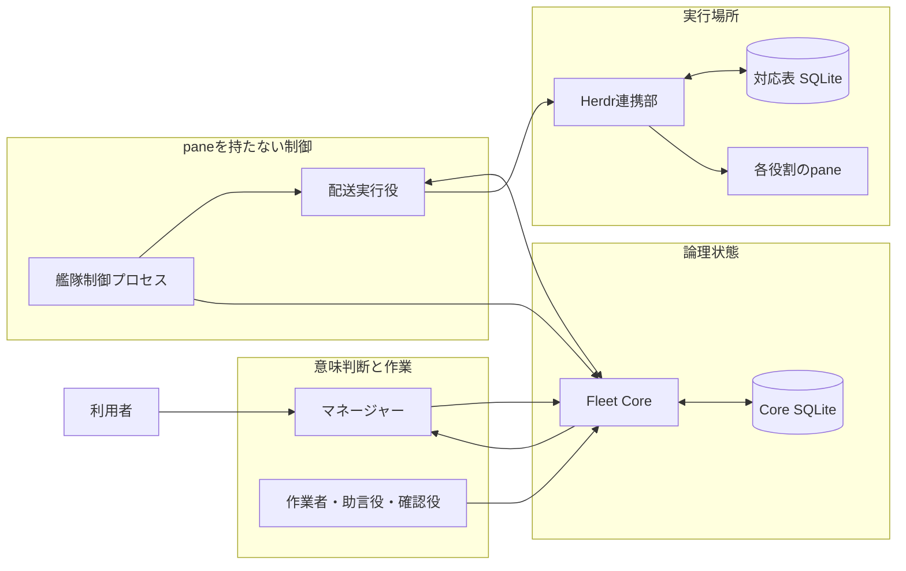
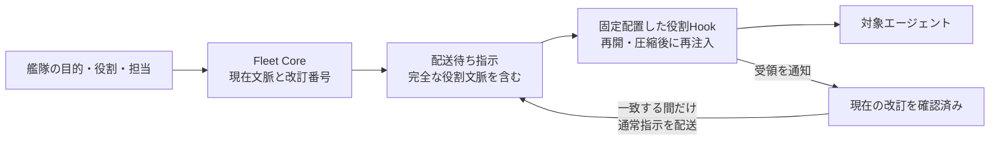
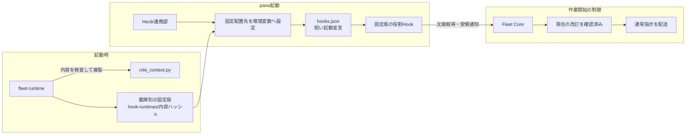
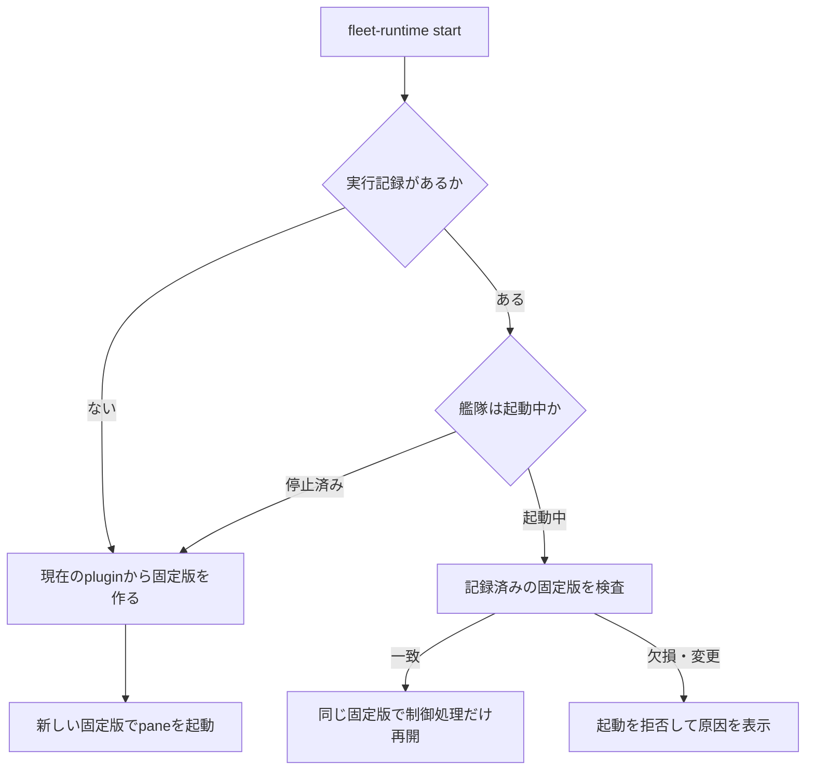
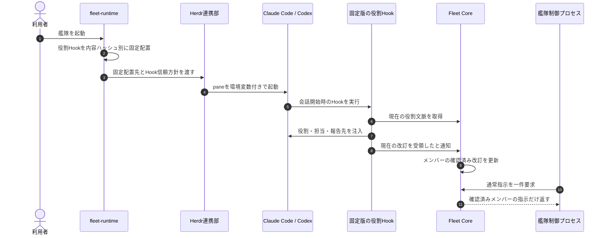
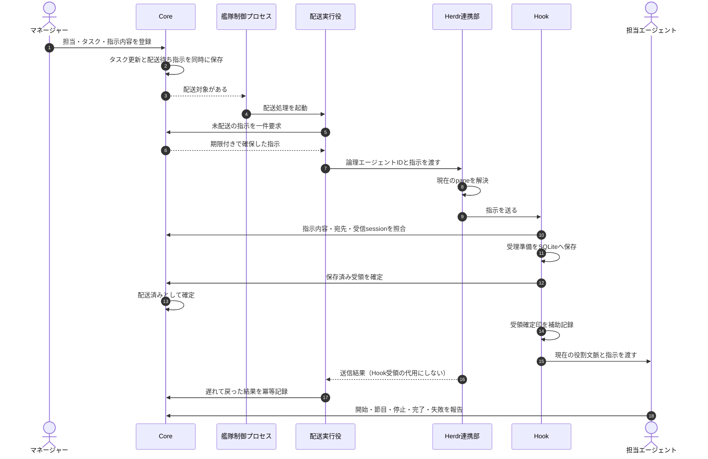
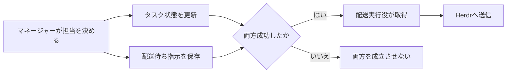
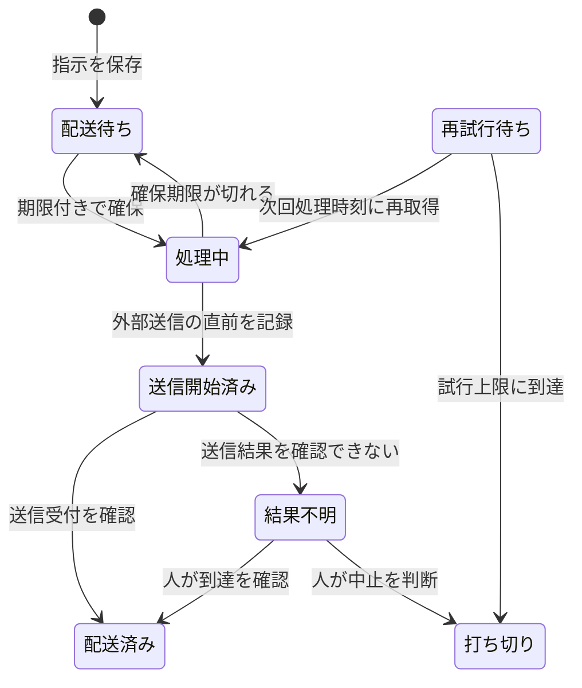
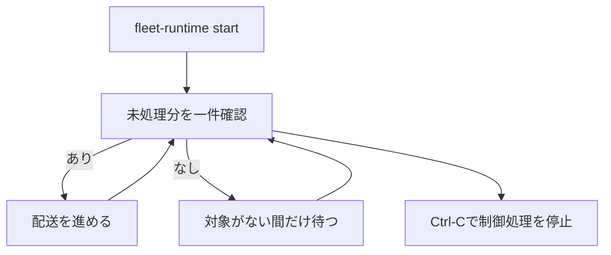
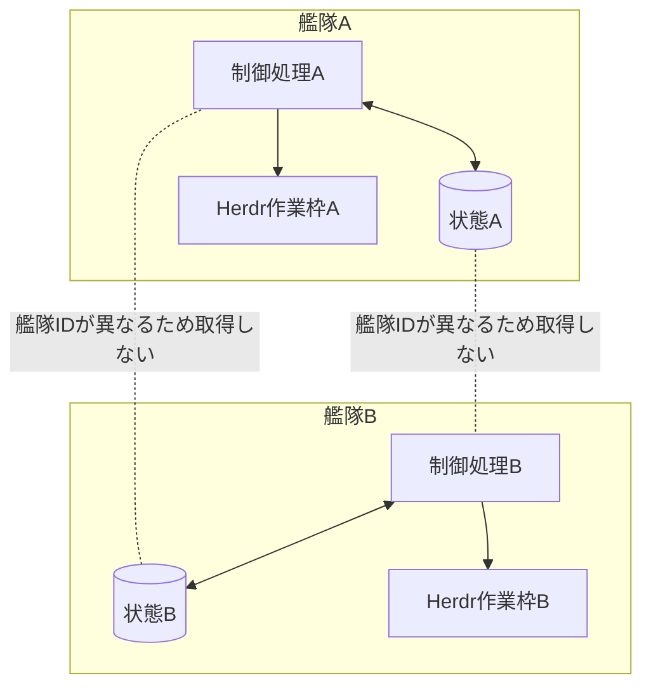

# エージェント艦隊の連携・全体制御

この資料は、指示・作業報告・確認結果・助言をどのように受け渡し、マネージャーが艦隊全体を監視できる状態を保つかを説明する。

> マネージャーは仕事の意味と最終判断を担い、Coreは事実を保存し、paneを持たない艦隊制御プロセスが未配送の指示と通知をHerdrへ流す。各メンバーには、改訂番号付きの現在の役割文脈を指示ごとに渡す。

## 目的

**マネージャーやHerdrが一時停止しても指示と報告を失わず、同じ状態から作業を再開できるようにする。** 同時に、機械的な配送と、目的に照らした意味判断を分離する。

この構成が解決する問題は次の四つである。

1. マネージャーの記憶だけでは、再起動後に担当、未完了作業、未確認報告を再現できない。
2. pane番号を担当者の識別子にすると、paneの作り直しで指示先が壊れる。
3. 指示を保存せず直接送ると、送信前の停止で指示が消える。
4. 配送処理に意味判断を持たせると、全体進捗を要約する主体が曖昧になる。

## 責務の境界

**全体制御は、意味判断、論理状態、配送制御、実行場所の四層に分ける。**

| 構成要素 | 担うこと | 担わないこと | pane |
|---|---|---|---|
| マネージャー | 目的、完了条件、停止条件、担当、全体進捗要約、最終判断 | SQLite巡回、配送順序、pane番号の解決 | 持つ |
| 作業者・確認役・助言役 | 担当範囲の実行と明示報告 | 全体進捗要約、他者の担当変更 | 持つ |
| Fleet Core | 艦隊、担当、タスク、報告、履歴、配送待ち指示の整合性と状態一覧 | Herdr操作、pane番号、報告の意味解釈 | 持たない |
| 艦隊制御プロセス | 配送対象と期限超過の検出、配送起動、復旧時の再確認 | 作業、要約、完了判断 | 持たない |
| 配送実行役 | Coreから配送対象を一件確保し、配送結果を返す | タスク判断、報告要約 | 持たない |
| Herdr連携部 | 論理エージェントと現在のpaneを対応づけ、指示を送る | タスクと完了条件の管理 | 持たない |
| Herdr | エージェントのローカル実行場所を提供する | 艦隊全体の正本になること | paneを提供する |



SQLiteを直接読むのは、それを所有する構成要素だけである。Herdr連携部はCore SQLiteを直接監視せず、Coreの公開された操作を通す。

## 各メンバーが自身の役割を保つ仕組み

**役割、目的、担当、完了条件、停止条件、報告先の正本はFleet Coreである。** `AGENTS.md`と`CLAUDE.md`には変化しない作業原則だけを置く。現在の担当や進捗はCoreで改訂する。

この資料ではHookとCoreの責務境界を扱う。イベントごとの実行契機、promptの分岐、製品差は[役割Hookの実行契機と責務](2026-09-01-エージェント艦隊-役割Hookの実行契機と責務.md)を正本とする。

Coreが作る指示は、対象メンバーの完全な役割文脈と改訂番号を持つ。Hookは会話へ文脈を注入する。Coreは現在の改訂を受け取った事実が確認できるまで、通常の仕事を配送しない。



### Hookの設定と実処理を分ける

**`hooks.json`は起動条件だけを宣言し、役割同期の実処理を持たない。** JSONへPythonの探索処理やハッシュ検査を埋め込むと、同じ処理がイベントごとに複製される。テストも文字列検査へ偏るため、変更理由を追いにくい。

実処理は[`role_context.py`](../plugins/agent-fleet-herdr/hooks/role_context.py)へ集約する。`fleet-runtime start`は、その時点の実処理を艦隊専用の状態領域へ内容ハッシュ付きで固定配置する。Herdrは固定配置先を`AGENT_FLEET_HOOK_RUNTIME`として各paneへ渡す。

[`codex-hooks.json`](../plugins/agent-fleet-herdr/hooks/codex-hooks.json)と[`claude-hooks.json`](../plugins/agent-fleet-herdr/hooks/claude-hooks.json)に残す処理は一つだけである。環境変数があれば固定配置先を起動する。環境変数がなければ何もせず終了するため、艦隊に属さない通常の会話には影響しない。



この分離により、プラグインのキャッシュ版が削除されても起動済み艦隊は壊れない。起動済み艦隊は固定版を使い続ける。停止後の再起動では、新しいプラグインから新しい固定版を作る。



### Hookを強制する境界

**Hookの実行と仕事開始の許可は別々に強制する。** 製品側のHook機構は役割文脈を会話へ渡す。Core側の配送制限は、Hookが働かなかった会話へ通常指示を届けない。



Codexの`spec.runtime.codex_hook_trust`はHook信頼確認の扱いだけを決める。`preapproved`ではHerdrが起動するCodexに`--dangerously-bypass-hook-trust`を渡す。`review`ではCodexの確認を残す。この設定はtool承認やsandboxを解除しない。

Claude Codeのコマンド型Hookは、時間切れ時に入力そのものを確実には止められない。このため、Hookだけを安全境界にしない。Coreが現在の改訂を確認できない限り通常指示を返さない構成を併用する。

| 項目 | Claude Code | Codex |
|---|---|---|
| 設定 | `hooks/claude-hooks.json` | `hooks/codex-hooks.json` |
| 再開契機 | 起動、再開、初期化、圧縮、分岐 | 起動、再開、初期化、圧縮 |
| 永続領域 | `CLAUDE_PLUGIN_DATA` | `PLUGIN_DATA` |
| 分岐 | 新しい会話を未関連状態に戻す | 分岐契機なし |
| Hook信頼方針 | 製品側の設定に従う | `review`または`preapproved` |
| 仕事開始の最終条件 | Coreが現在の改訂受領を確認済み | Coreが現在の改訂受領を確認済み |

通常入力時にも、艦隊へ関連付け済みの会話はCoreへ現在の改訂番号を問い合わせる。Hook側SQLiteは会話とメンバーの関連付けや途中復旧に使う。役割文脈の正本にはしない。

役割同期はCoreが発行した一回限りの値をHookが消費する。通常指示では、Hookが指示ID、内容、送信元、宛先、受信会話をCoreと照合する。Hookは受理準備をSQLiteへ保存してから、Coreへ受領確定を通知する。

Coreの受領確定を配送済みの正本とする。受領確定の応答だけを失った場合は、同じ会話と指示の組み合わせで一度だけ再照合する。遅れて到着した古い指示や受領済み指示はCoreが拒否する。

### Hook強制の振る舞い

**次のBDDは、Hook設定、固定版、Coreの配送制限を一つの挙動として定める。** 各シナリオは単独で前提と結果を閉じる。

```gherkin
シナリオ: 起動済み艦隊がプラグイン更新後も同じHookで作業を続ける
  前提 艦隊が内容ハッシュAの役割Hookで起動済みである
  かつ プラグインの役割Hookが内容ハッシュBへ更新されている
  もし 利用者が同じ艦隊の起動コマンドを再実行する
  なら 艦隊制御プロセスは内容ハッシュAの固定版を検査する
  かつ 既存paneは内容ハッシュAの固定版を使い続ける
  かつ 新しいpaneを追加しない
```

```gherkin
シナリオ: 停止後の再起動で新しいHookへ切り替える
  前提 艦隊が内容ハッシュAの役割Hookで停止済みである
  かつ プラグインの役割Hookが内容ハッシュBへ更新されている
  もし 利用者が艦隊を再起動する
  なら fleet-runtimeは内容ハッシュBの固定版を作る
  かつ Herdrは各paneへ内容ハッシュBの固定配置先を渡す
  かつ Coreは以前の役割文脈確認を無効にする
```

```gherkin
シナリオ: 固定版が変更されている艦隊を再開しない
  前提 起動済み艦隊の実行記録に内容ハッシュAが保存されている
  かつ 固定配置された役割Hookの内容が内容ハッシュAと一致しない
  もし 利用者が同じ艦隊の起動コマンドを再実行する
  なら fleet-runtimeは再開を拒否する
  かつ Herdrは新しいpaneを作らない
  かつ 艦隊制御プロセスは通常指示の配送を始めない
```

```gherkin
シナリオ: CodexのHook確認だけを事前承認して艦隊を起動する
  前提 艦隊設定のcodex_hook_trustがpreapprovedである
  もし HerdrがCodexのpaneを起動する
  なら HerdrはCodexのHook信頼確認を省略する起動引数を渡す
  かつ Codexのtool承認方針は変更しない
  かつ Codexのsandbox方針は変更しない
```

```gherkin
シナリオ: 役割文脈を確認できない会話へ通常指示を届けない
  前提 対象メンバーの現在の役割文脈が改訂番号2である
  かつ 対象の会話は改訂番号2の受領をCoreへ通知していない
  もし 艦隊制御プロセスが対象メンバーの通常指示を要求する
  なら Coreはその通常指示を返さない
  かつ 役割文脈の同期指示だけを配送対象にできる
```

## マネージャーはどう監視するか

**マネージャーはpaneの出力量ではなく、Coreに残った明示報告と状態一覧を読む。** 状態一覧は事実の並び替えと集計だけを行い、意味を付け足さない。

| 状態一覧の区分 | 内容 |
|---|---|
| 艦隊 | 艦隊ID、目的、最終更新時刻 |
| メンバー | 論理エージェントID、役割、稼働状態 |
| タスク | 担当、状態、最後の報告、次回報告予定 |
| 報告 | 節目、現在の作業、成果物、停止理由、未確認範囲 |
| 要確認 | 報告期限超過、配送結果不明、未受容の完了報告 |
| 配送 | 配送待ち、処理中、配送済み、結果不明、打ち切りの件数 |

マネージャーはこの一覧を目的・完了条件・停止条件に照らし、「順調」「修正が必要」「判断待ち」「停止すべき」といった全体進捗要約を作る。Coreと艦隊制御プロセスは、この意味判断を行わない。


## 指示を届ける流れ

**指示は先にCoreへ保存し、その後で配送する。** タスク更新と配送待ち指示を同じ処理で確定し、片方だけが残る状態を避ける。



配送済みはHookが指示をCoreと照合して受領したことだけを表し、作業完了を表さない。Herdrが入力開始を観測してもHook受領がなければ結果不明とする。作業完了は担当エージェントの明示報告で別に確定する。

## 配送待ち指示が果たす役割

**配送待ち指示は、状態変更と外部送信の間を切り離す。** 実装上のテーブル名は`outbox`だが、役割が分かるように本文では「配送待ち指示」と呼ぶ。

タスクを作業者へ割り当てるときは、次の二つを一度に保存する。

1. タスクの担当が決まった事実
2. その作業者へ届ける配送待ち指示

保存後にHerdrが停止しても両方が残るため、復旧後に未配送分を取得できる。マネージャーが同じ指示を作り直す必要はない。



「送信結果を確認できない」場合は、すでに届いた可能性があるため自動再送しない。

## 配送状態とタスク状態を分ける

**通信の成否と仕事の成否は別の状態である。**



配送失敗でタスクを自動失敗にせず、配送済みでタスクを自動完了にしない。

## 複数の艦隊編成とpane配置を設定する

**艦隊編成とpane配置は別ファイルにし、艦隊から版固定の表示プロファイルを一方向に参照する。** 表示プロファイルから艦隊を参照させない。

**これら二種類の設定実体はpluginへ同梱しない。** pluginが持つのは形式、検査、解決、起動の機構だけである。通常運用では利用者領域の`~/.config/agent-fleet`だけを読み、pluginのinstall先を表示設定の探索先へ暗黙追加しない。repository直下の`configs`は利用者設定の開始例であり、plugin packageの一部でも既定値でもない。

```mermaid
flowchart LR
    F[艦隊設定<br/>誰が何を担うか]
    R[profile_ref<br/>local/development-focus@1]
    V[表示プロファイル<br/>分割方向と重み]
    P[Herdr配置計画]
    F --> R --> V --> P
```

艦隊設定には目的、メンバー、担当候補、完了条件、停止条件を置く。実際のpane番号、workspace番号、比率、設定ファイルのpathは置かない。表示プロファイルにはマネージャー領域とその他領域の重み、分割方向、対応人数を置き、艦隊IDやpane番号を置かない。

同じ表示プロファイルの識別子と版が二件見つかった場合、探索順で片方を選ばず起動を拒否する。内容を変える場合は既存版を上書きせず、新しい版を作る。

```yaml
# 艦隊設定
spec:
  view:
    profile_ref: local/development-focus@1
```

```yaml
# 表示プロファイル
metadata:
  id: local/development-focus
  version: 1
spec:
  layout:
    type: split
    direction: horizontal
    children:
      - type: slot
        selector: manager
        weight: 36
      - type: stack
        selector: non-manager
        weight: 64
        direction: vertical
        distribution: equal
```

最初に利用者領域を初期化して開始例を複製し、その後は利用者側のファイルだけを編集する。

```bash
plugins/agent-fleet-herdr/adapter/scripts/fleet-runtime init
plugins/agent-fleet-herdr/adapter/scripts/fleet-runtime doctor
mkdir -p ~/.config/agent-fleet/fleets ~/.config/agent-fleet/view-profiles
cp configs/fleets/*.yml ~/.config/agent-fleet/fleets/
cp configs/view-profiles/*.yml ~/.config/agent-fleet/view-profiles/
```

一つの入口で設定の一覧、変更を伴わない計画、起動、状態確認を行う。設定名がそのまま起動名になるため、ファイルごとの手書きスクリプトは増やさない。

```bash
plugins/agent-fleet-herdr/adapter/scripts/fleet-runtime list
```

```bash
plugins/agent-fleet-herdr/adapter/scripts/fleet-runtime plan development-squad
```

```bash
plugins/agent-fleet-herdr/adapter/scripts/fleet-runtime start development-squad --execute
```

Core CLIが`PATH`にない場合は`--core-command`で公開CLIの絶対パスを渡すか、`AGENT_FLEET_CORE_COMMAND`へ設定する。Herdr pluginからCore pluginの配置は推測しない。

別の利用者設定directoryを使う場合だけ`--fleet-dir`と`--profile-dir`を指定する。起動時の作業directoryは現在位置、エージェント種別はCodexを既定とする。比率を一時引数で上書きせず、再現可能な新しい表示プロファイル版として保存する。

## paneを持たない艦隊制御プロセス

**艦隊制御プロセスはエージェントではなく、判断を持たないローカル処理である。** そのためpaneを割り当てない。

`fleet-runtime start`は艦隊のpaneを作った後、同じターミナルで制御処理をforeground実行する。制御処理自身のpaneは作らず、配送対象がある間は一件処理を続け、対象がない間だけ段階的に待つ。同じFleetの制御処理はファイルロックで一つに限定する。`Ctrl-C`は制御処理だけを止め、各役割のpaneと確定済み状態を残す。同じ起動コマンドを再実行すると、paneを増やさず制御処理を再開する。

workspaceも閉じる場合は`fleet-runtime stop <fleet_id> --execute`を使う。Coreの履歴は残る。Fleet設定を作り直す場合だけ`fleet-runtime remove <fleet_id> --execute`を使い、Core状態も明示的に削除する。



各艦隊のCore DBとHerdr対応表DBは別directoryへ保存する。これにより、一つの艦隊のロックや破損が別艦隊へ波及しない。

## 人がいつでも状態を確認する方法

**読み取り専用コマンドを使い、制御用paneは作らない。** 利用者向けには次のコマンドを使う。

```bash
plugins/agent-fleet-herdr/adapter/scripts/fleet-runtime status development-squad \
  --state-dir <状態directory>
```

このコマンドはCoreのメンバー、タスク、報告、配送件数と、Herdrの論理メンバー・pane対応、使用中の表示プロファイルを結合して返す。起動後に設定内容が変わった場合は、黙って再配置せず`configuration_drift`として示す。

## 複数艦隊を同じ端末で動かす

**状態取得と配送対象の確保は、常に艦隊IDで範囲を限定する。** 別艦隊の指示を取得してはならない。



MVPは一台のMac内での複数艦隊を対象とする。別端末間でのSQLite共有、艦隊間の直接通信、独自Web UIは対象外である。

## 現在の実装と目標構成の差

**未実装部分を、現在自動で動いているものとして扱わない。**

| 項目 | 現在 | 目標 |
|---|---|---|
| 艦隊・メンバー・タスク・履歴の保存 | 実装済み | 維持 |
| 配送待ち指示 | 期限付き確保、送信開始、配送済み、結果不明、打ち切りを実装済み | 人による結果不明の解消操作を追加 |
| Herdrへの論理ID配送 | paneを持たない配送実行役から利用済み | 実Herdrの継続的な負荷検証 |
| 完了・失敗・停止の明示報告 | 節目報告と次回報告予定を含め実装済み | 二回連続の期限超過を利用者判断へ上げる通知を追加 |
| 決定的な状態一覧 | 報告、次回報告予定、配送集計まで実装済み | 期限超過回数と制御処理の最終成功時刻を追加 |
| paneを持たない艦隊制御プロセス | foreground制御と一回配送を実装済み | OS再起動後の自動復旧は未実装 |
| Herdr作業枠の作成復旧 | 作成操作ごとのランダムIDを含む専用名を作成前に記録し、台帳保存前の中断も次回起動時に一覧から一意に回収。同じ艦隊への直接操作もプロセス間ロックで直列化 | 強制終了を繰り返す実機試験 |
| 配送実行役 | 期限付き確保、送信開始記録、配送結果記録を実装済み | 人による結果不明の解消操作を追加 |
| マネージャー宛て進捗通知 | 報告保存と同時に配送待ちへ追加し、作業者の役割文脈更新より先に配送する。五体の実艦隊で受信・検査・受理まで確認済み | 継続負荷で検証 |
| 役割文脈 | 製品別Hook再注入、一回限りの役割同期、固定版の検査、通常指示のCore照合、確認済み改訂だけへの配送を実装済み | 複数会話・長時間運転を継続検証 |
| 複数編成・pane比率 | 艦隊設定、表示プロファイル、一覧・計画・起動・停止・削除・状態確認を実装済み | 明示的な再配置操作を追加 |
| マネージャーによる要約 | 役割規約として定義し、五体の実艦隊で作業報告の検査、受理、全体進捗要約を確認済み | 継続運転で検証 |

## 設計上の不変条件

1. マネージャー以外が全体進捗の意味を要約しない。
2. CoreはHerdrのpane番号を保存しない。
3. Herdr連携部はCore SQLiteを直接読まない。
4. 配送結果だけでタスクを完了・失敗へ変えない。
5. 送信結果が不明な指示を自動再送しない。
6. 同じ指示を複数の配送実行役が同時に確保しない。
7. 艦隊制御プロセスと配送実行役はpaneを持たない。
8. 人は読み取り専用コマンドで現在状態を確認できる。
9. 艦隊設定は版固定の表示プロファイルだけを参照し、表示プロファイルは艦隊を逆参照しない。
10. 各指示は対象メンバーの完全な役割文脈と改訂番号を持つ。
11. `hooks.json`は固定版を起動する宣言だけを持ち、役割同期の実処理を持たない。
12. 起動済み艦隊は記録済みの固定版を検査して使い、プラグイン更新へ暗黙追従しない。
13. Coreが現在の役割改訂の受領を確認するまで、通常指示を配送しない。

## 関連資料

- [作業進行ルール](2026-08-31-エージェント艦隊-作業進行ルール.md) — 誰が報告、要約、判断を担うか
- [非機能要件](2026-08-31-エージェント艦隊-非機能要件.md) — 待ち時間、並行実行、復旧、計測方法
- [役割Hookの実行契機と責務](2026-09-01-エージェント艦隊-役割Hookの実行契機と責務.md) — セッション開始時とprompt送信時の処理
- [Fleet Core](../plugins/agent-fleet-core/core/SKILL.md) — 現行Coreの公開操作
- [Herdr連携部](../plugins/agent-fleet-herdr/adapter/SKILL.md) — 現行Herdr連携の公開操作
