# エージェント艦隊の連携・全体制御

この資料は、指示・作業報告・確認結果・助言をどのように受け渡し、マネージャーが艦隊全体を監視できる状態を保つかを説明する。

> マネージャーは仕事の意味と最終判断を担い、Coreは事実を保存し、paneを持たない艦隊制御プロセスが未配送の指示と通知をHerdrへ流す。各メンバーには、改訂番号付きの現在の役割文脈を指示ごとに渡す。

## 目的

**マネージャーやHerdrが一時停止しても指示と報告を失わず、同じ状態から作業を再開できるようにする。** 同時に、機械的な配送と、目的に照らした意味判断を分離する。

この構成が解決する問題は次の四つである。

1. マネージャーの記憶だけでは、再起動後に担当、未完了作業、未確認報告を再現できない。
2. pane番号を担当者の識別子にすると、paneの作り直しで指示先が壊れる。
3. 指示を保存せず直接送ると、送信前の停止で指示が消える。
4. 配送処理に意味判断を持たせると、全体進捗を要約する主体が曖昧になる。

## 責務の境界

**全体制御は、意味判断、論理状態、配送制御、実行場所の四層に分ける。**

| 構成要素 | 担うこと | 担わないこと | pane |
|---|---|---|---|
| マネージャー | 目的、完了条件、停止条件、担当、全体進捗要約、最終判断 | SQLite巡回、配送順序、pane番号の解決 | 持つ |
| 作業者・確認役・助言役 | 担当範囲の実行と明示報告 | 全体進捗要約、他者の担当変更 | 持つ |
| Role Catalog | 役割の目的、責務、禁止事項、権限、受け渡し関係 | agent instance、タスク状態、配送 | 持たない |
| Fleet Core | Catalogから解決した役割定義の固定版、艦隊、担当、タスク、報告、履歴、配送待ち指示の整合性と状態一覧 | 役割の意味の定義、Herdr操作、pane番号、報告の意味解釈 | 持たない |
| 艦隊制御プロセス | 配送対象と期限超過の検出、配送起動、復旧時の再確認 | 作業、要約、完了判断 | 持たない |
| 配送実行役 | Coreから配送対象を一件確保し、配送結果を返す | タスク判断、報告要約 | 持たない |
| Herdr連携部 | 論理エージェントと現在のpaneを対応づけ、指示を送る | タスクと完了条件の管理 | 持たない |
| Herdr | エージェントのローカル実行場所を提供する | 艦隊全体の正本になること | paneを提供する |

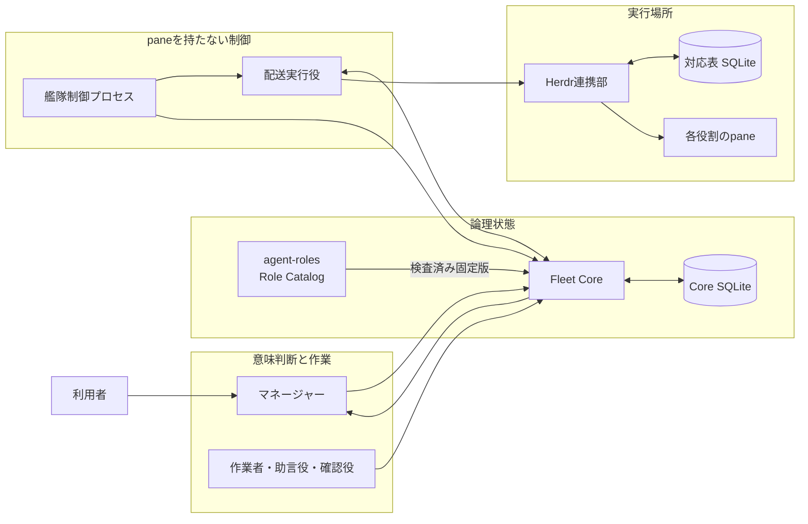

SQLiteを直接読むのは、それを所有する構成要素だけである。Herdr連携部はCore SQLiteを直接監視せず、Coreの公開された操作を通す。

## 各メンバーが自身の役割を保つ仕組み

**役割の意味の正本は`agent-roles`のRole Catalog、解決済み役割の固定版と目的、担当、完了条件、停止条件、報告先の正本はFleet Coreである。** `AGENTS.md`と`CLAUDE.md`には変化しない作業原則だけを置く。現在の担当や進捗はCoreで改訂する。

この資料ではHookとCoreの責務境界を扱う。イベントごとの実行契機、promptの分岐、製品差は[役割Hookの実行契機と責務](2026-09-01-エージェント艦隊-役割Hookの実行契機と責務.md)を正本とする。

Coreが作る指示は、対象メンバーの完全な役割文脈と改訂番号を持つ。Hookは会話へ文脈を注入する。Coreは現在の改訂を受け取った事実が確認できるまで、通常の仕事を配送しない。

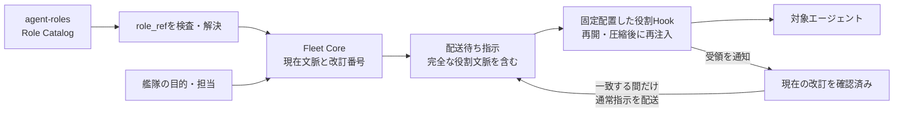

### Hookの設定と実処理を分ける

**`hooks.json`は起動条件だけを宣言し、役割同期の実処理を持たない。** JSONへPythonの探索処理やハッシュ検査を埋め込むと、同じ処理がイベントごとに複製される。テストも文字列検査へ偏るため、変更理由を追いにくい。

実処理は[`role_context.py`](../plugins/agent-fleet-herdr/hooks/role_context.py)へ集約する。`fleet-runtime start`は、その時点の実処理を艦隊専用の状態領域へ内容ハッシュ付きで固定配置する。Herdrは固定配置先を`AGENT_FLEET_HOOK_RUNTIME`として各paneへ渡す。

[`codex-hooks.json`](../plugins/agent-fleet-herdr/session-hooks-plugin/hooks/codex-hooks.json)と[`claude-hooks.json`](../plugins/agent-fleet-herdr/session-hooks-plugin/hooks/claude-hooks.json)は艦隊専用Hook pluginに置く。Herdr連携plugin本体にはHookを登録しない。`fleet-runtime start`が、Codexではsession設定による有効化、Claude Codeでは`--plugin-dir`による読込をHerdrへ指示するため、通常セッションではHookイベント自体が登録されない。Hook plugin内の処理は、環境変数が欠けた場合に何もせず終了する二重の防御も持つ。

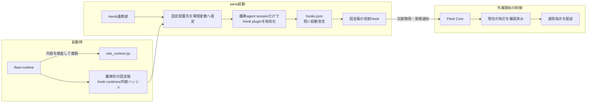

この分離により、プラグインのキャッシュ版が削除されても起動済み艦隊は壊れない。起動済み艦隊は固定版を使い続ける。停止後の再起動では、新しいプラグインから新しい固定版を作る。

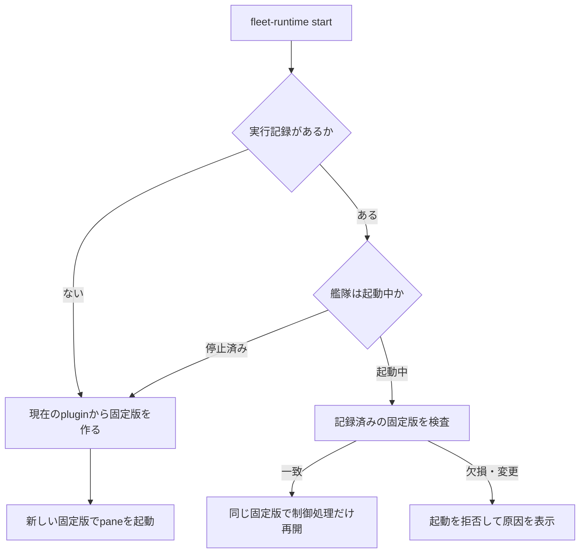

### Hookを強制する境界

**Hookの実行と仕事開始の許可は別々に強制する。** 製品側のHook機構は役割文脈を会話へ渡す。Core側の配送制限は、Hookが働かなかった会話へ通常指示を届けない。

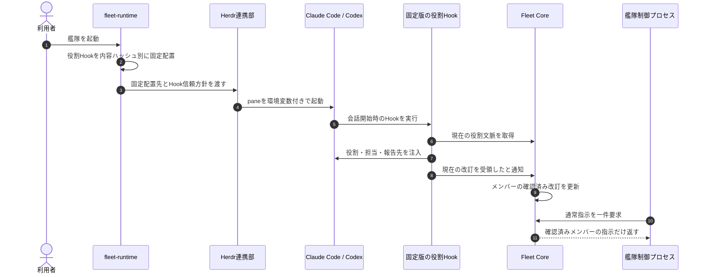

Herdr起動設定の`spec.codex_hook_trust`はHook信頼確認の扱いだけを決める。`preapproved`ではHerdrが起動するCodexに`--dangerously-bypass-hook-trust`を渡す。`review`ではCodexの確認を残す。この設定はtool承認やsandboxを解除しない。

通常セッションでのHook無効化は信頼方針とは別である。Claude Codeは艦隊起動時だけ`--plugin-dir`でHook pluginを読む。CodexのHook pluginは解決用にinstallするが通常時を無効にし、艦隊起動時だけ`--config plugins.agent-fleet-session-hooks@agent-fleet.enabled=true`で有効にする。

Claude Codeのコマンド型Hookは、時間切れ時に入力そのものを確実には止められない。このため、Hookだけを安全境界にしない。Coreが現在の改訂を確認できない限り通常指示を返さない構成を併用する。

| 項目 | Claude Code | Codex |
|---|---|---|
| 設定 | `session-hooks-plugin/hooks/claude-hooks.json` | `session-hooks-plugin/hooks/codex-hooks.json` |
| 通常時の登録 | なし | install済み・無効 |
| 艦隊起動時の登録 | `--plugin-dir` | sessionの`--config` |
| 再開契機 | 起動、再開、初期化、圧縮、分岐 | 起動、再開、初期化、圧縮 |
| 永続領域 | `CLAUDE_PLUGIN_DATA` | `PLUGIN_DATA` |
| 分岐 | 新しい会話を未関連状態に戻す | 分岐契機なし |
| Hook信頼方針 | 製品側の設定に従う | `review`または`preapproved` |
| 仕事開始の最終条件 | Coreが現在の改訂受領を確認済み | Coreが現在の改訂受領を確認済み |

通常入力時にも、艦隊へ関連付け済みの会話はCoreへ現在の改訂番号を問い合わせる。Hook側SQLiteは会話とメンバーの関連付けや途中復旧に使う。役割文脈の正本にはしない。

役割同期はCoreが発行した一回限りの値をHookが消費する。通常指示では、Hookが指示ID、内容、送信元、宛先、受信会話をCoreと照合する。Hookは受理準備をSQLiteへ保存してから、Coreへ受領確定を通知する。

Coreの受領確定を配送済みの正本とする。受領確定の応答だけを失った場合は、同じ会話と指示の組み合わせで一度だけ再照合する。遅れて到着した古い指示や受領済み指示はCoreが拒否する。

### Hook強制の振る舞い

**次のBDDは、Hook設定、固定版、Coreの配送制限を一つの挙動として定める。** 各シナリオは単独で前提と結果を閉じる。

```gherkin
Scenario: 起動済み艦隊は導入元のHook更新へ暗黙追従しない
  Given 艦隊が内容ハッシュAの役割Hookで起動済みである
  And プラグインの役割Hookが内容ハッシュBへ更新されている
  When 利用者が同じ艦隊の起動コマンドを再実行する
  Then fleet-runtimeは保存済みの内容ハッシュAを検査して制御処理だけを再開する
  And 既存paneと制御処理は内容ハッシュAの固定版を使い続ける
  And 新しいpaneを追加しない
```

```gherkin
Scenario: 停止後の再起動で新しいHook固定版へ切り替える
  Given 艦隊Aが内容ハッシュAの役割Hookで停止済みである
  And プラグインの役割Hookが内容ハッシュBへ更新されている
  When 利用者が同じ艦隊IDを再起動する
  Then fleet-runtimeは現在のプラグインから内容ハッシュBの固定版を作る
  And Herdrは新しいpaneを起動する
  And Coreは新しい役割文脈確認を開始する
```

```gherkin
Scenario: 異なるHookを新しいfleet IDで起動する
  Given 艦隊Aが内容ハッシュAの役割Hookで起動済みである
  And プラグインの役割Hookが内容ハッシュBへ更新されている
  When 利用者が艦隊Bを新しいfleet IDで起動する
  Then fleet-runtimeは艦隊Bを起動する
  And 艦隊Bは内容ハッシュBの固定版を使う
  And 艦隊Aは内容ハッシュAの固定版を使い続ける
```

```gherkin
Scenario: 固定版が変更されている艦隊を再開しない
  Given 起動済み艦隊の実行記録に内容ハッシュAが保存されている
  And 固定配置された役割Hookの内容が内容ハッシュAと一致しない
  When 利用者が同じ艦隊の起動コマンドを再実行する
  Then fleet-runtimeは再開を拒否する
  And Herdrは新しいpaneを作らない
  And 艦隊制御プロセスは通常指示の配送を始めない
NOTE:
  Rule: 起動中の実行条件を暗黙に変更しない
  Reason: 保存済みの固定版と実体の一致を確認できないため
```

```gherkin
Scenario: CodexのHook確認だけを事前承認して艦隊を起動する
  Given 艦隊設定のcodex_hook_trustがpreapprovedである
  When HerdrがCodexのpaneを起動する
  Then HerdrはCodexのHook信頼確認を省略する起動引数を渡す
  And Codexのtool承認方針は変更しない
  And Codexのsandbox方針は変更しない
```

```gherkin
Scenario: Codexの役割Hook登録がない間はCodexの作業枠を作らない
  Given 艦隊FのメンバーにCodexが含まれる
  And Codexにagent-fleet-session-hooksが登録されていない
  When 利用者が艦隊Fの新規起動を実行する
  Then fleet-runtimeは必要な登録名を示して起動を拒否する
  And HerdrはCodexの作業枠を作らない
  And 艦隊stateを作らない
NOTE:
  Rule: CodexのHook登録は外部前提として新規起動前に確認する
  Reason: Codex CLIはセッション単位のplugin directory指定を持たず、登録名からHook宣言を解決するため
```

```gherkin
Scenario: 役割文脈を確認できない会話へ通常指示を届けない
  Given 対象メンバーの現在の役割文脈が改訂番号2である
  And 対象の会話は改訂番号2の受領をCoreへ通知していない
  When 艦隊制御プロセスが対象メンバーの通常指示を要求する
  Then Coreはその通常指示を返さない
  And 役割文脈の同期指示だけを配送対象にできる
NOTE:
  Rule: メンバーは現在の役割文脈で行動する
  Reason: 対象会話が現在の改訂を確認した事実がないため
```

```gherkin
Scenario: 同じ起動済み艦隊を再指定しても作業枠を増やさない
  Given 艦隊Fは利用者設定と一致する五つの作業枠で起動済みである
  When 利用者が艦隊Fの起動コマンドを再実行する
  Then 艦隊Fは同じ五つの作業枠を使い続ける
  And 新しい作業枠は作られない
```

```gherkin
Scenario: 起動中の艦隊へ異なる編成を暗黙適用しない
  Given 艦隊Fは編成Aで起動済みである
  And 利用者設定の艦隊Fは編成Bへ変更されている
  When 利用者が艦隊Fの起動コマンドを再実行する
  Then 艦隊Fの再開は拒否される
  And 既存の作業枠と担当対応は変更されない
NOTE:
  Rule: 起動中の編成を暗黙に変更しない
  Reason: 停止を経ずに別の編成を安全に適用できないため
```

```gherkin
Scenario: 二つの配送実行役が同じ指示を取得しない
  Given 艦隊Fに未配送の指示Cが一件ある
  When 二つの配送実行役が同時に次の指示を要求する
  Then 指示Cを取得できる配送実行役は一つだけである
  And もう一つの配送実行役は指示Cを取得しない
```

```gherkin
Scenario: 送信結果不明の指示を自動で再送しない
  Given 指示Cは外部送信を開始済みである
  And 指示Cの到達結果を確認できない
  When 確保期限を過ぎて配送処理が再開する
  Then 指示Cは結果不明のまま維持される
  And 指示Cは自動の配送対象にならない
```

```gherkin
Scenario: 遅れて届いたHook受領で結果不明を配送済みへ訂正する
  Given 指示Cは結果不明として記録されている
  And 対象会話は指示CをCoreと照合して受領している
  When Hookが指示Cの受領をCoreへ通知する
  Then 指示Cは配送済みになる
  And 遅れて返る配送結果はその確定を変更しない
```

```gherkin
Scenario: Hook受領と送信結果が同時でも配送済みから戻さない
  Given 配送実行役が指示Cの外部送信を開始している
  And 対象会話が指示CをCoreと照合して受領しようとしている
  When Hookの受領確定と配送実行役の結果不明記録が同時に進む
  Then 指示Cの最終状態は配送済みになる
  And 配送済みの後に結果不明へ戻らない
```

```gherkin
Scenario: 同じ論理識別子を持つ複数艦隊を混同しない
  Given 艦隊F1と艦隊F2には同じ論理識別子の作業者Wがいる
  And 各艦隊で作業者Wの作業枠は異なる
  When 艦隊F1の作業者Wへ指示を届ける
  Then 指示は艦隊F1の作業枠へ届く
  And 艦隊F2の作業枠へは届かない
```

```gherkin
Scenario: 消失した作業枠へ別の作業枠を自動対応付けしない
  Given 艦隊Fの作業者Wに対応する作業枠が消失している
  When 艦隊制御プロセスが作業者Wへ指示を届けようとする
  Then 指示は配送されない
  And 作業者Wは再対応付けが必要な状態として示される
NOTE:
  Rule: 論理担当と実行場所の対応を推測しない
  Reason: 代替作業枠が同じ作業者のものだと確認できないため
```

```gherkin
Scenario: 利用者設定だけから艦隊と表示配置を解決する
  Given 利用者領域に艦隊設定と版固定された表示プロファイルがある
  And プラグインの配置先にも開始例がある
  When 利用者が艦隊設定名を指定して起動計画を確認する
  Then 利用者領域の設定だけが解決対象になる
  And プラグイン配置先の開始例は暗黙に使われない
```

```gherkin
Scenario: dry-runでは艦隊状態と作業枠を変更しない
  Given 利用者は艦隊Fの起動計画を確認したい
  When 利用者が実行指定なしで起動計画を要求する
  Then 解決済みの編成と表示配置が返される
  And 艦隊状態は作成されない
  And Herdrの作業枠は作られない
```

## マネージャーはどう監視するか

**マネージャーはpaneの出力量ではなく、Coreに残った明示報告と状態一覧を読む。** 状態一覧は事実の並び替えと集計だけを行い、意味を付け足さない。

通常の監視では、Coreの公開操作`task.list`を使う。この操作はタスクの担当、状態、期待する成果、完了条件、宣言順の`depends_on`、最新の状態報告、最新の進捗報告、次回報告予定、報告期限状態だけを返す。依存しないタスクの`depends_on`は空配列であり、完了時の状態報告はタスク受入後も読める。マネージャーはCore SQLiteを直接読まず、艦隊全体の大きなJSONを`jq`などで加工して監視結果を作らない。これにより、実行環境ごとのcommand配置に依存せず、Coreが保証した同じ形の事実だけで受入判断できる。

| 状態一覧の区分 | 内容 |
|---|---|
| 艦隊 | 艦隊ID、目的、最終更新時刻 |
| メンバー | 論理エージェントID、役割、稼働状態 |
| タスク | 担当、状態、期待する成果、完了条件、宣言順の`depends_on`、最後の状態報告、最後の進捗報告、次回報告予定 |
| 報告 | 節目、現在の作業、成果物、停止理由、未確認範囲 |
| 要確認 | 報告期限超過、配送結果不明、未受容の完了報告 |
| 配送 | 配送待ち、処理中、配送済み、結果不明、打ち切りの件数 |

```gherkin
Scenario: マネージャーがCoreの公開操作から進捗を判断する
  Given 作業者がタスクの進捗または完了をCoreへ明示報告している
  And マネージャーはそのタスクをまだ受け入れていない
  When マネージャーが監視対象のタスク一覧を要求する
  Then Coreは担当、状態、期待する成果、完了条件、宣言順のdepends_on、最新の状態報告、最新の進捗報告、次回報告予定、報告期限状態を返す
  And マネージャーはSQLiteの直接参照や外部JSON加工commandを必要としない
  And マネージャーはreportedと最新報告を照合するまでタスクを受け入れない
```

マネージャーはこの一覧を目的・完了条件・停止条件に照らし、「順調」「修正が必要」「判断待ち」「停止すべき」といった全体進捗要約を作る。Coreと艦隊制御プロセスは、この意味判断を行わない。

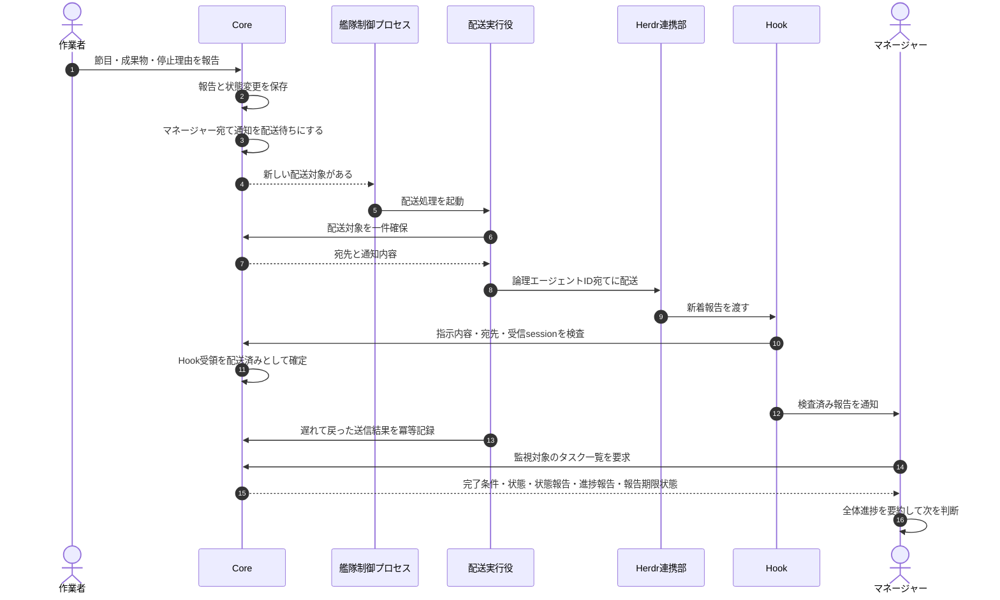

## 指示を届ける流れ

**指示は先にCoreへ保存し、その後で配送する。** タスク更新と配送待ち指示を同じ処理で確定し、片方だけが残る状態を避ける。

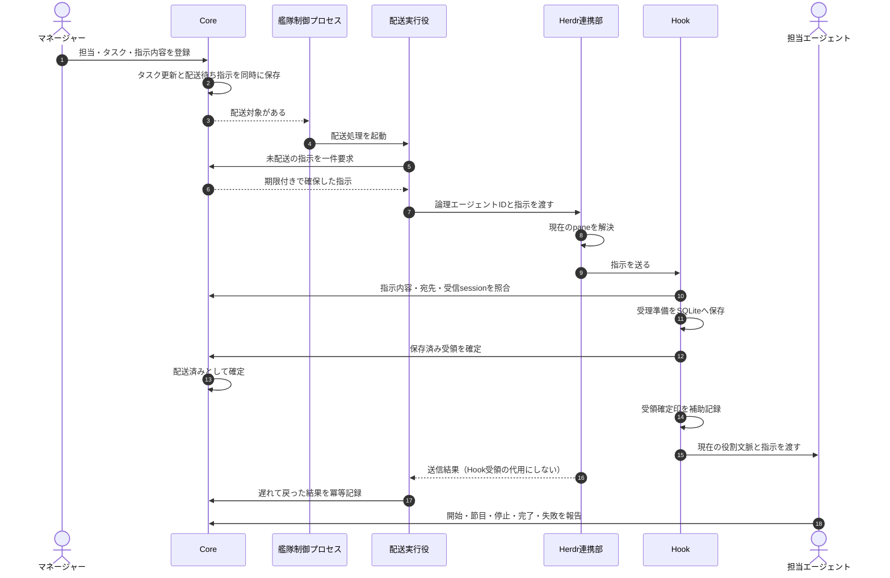

配送済みはHookが指示をCoreと照合して受領したことだけを表し、作業完了を表さない。Herdrが入力開始を観測してもHook受領がなければ結果不明とする。作業完了は担当エージェントの明示報告で別に確定する。

## 配送待ち指示が果たす役割

**配送待ち指示は、状態変更と外部送信の間を切り離す。** 実装上のテーブル名は`outbox`だが、役割が分かるように本文では「配送待ち指示」と呼ぶ。

タスクを作業者へ割り当てるときは、次の二つを一度に保存する。

1. タスクの担当が決まった事実
2. その作業者へ届ける配送待ち指示

保存後にHerdrが停止しても両方が残るため、復旧後に未配送分を取得できる。マネージャーが同じ指示を作り直す必要はない。

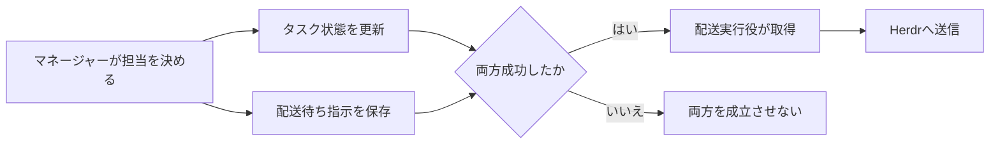

「送信結果を確認できない」場合は、すでに届いた可能性があるため自動再送しない。

## 配送状態とタスク状態を分ける

**通信の成否と仕事の成否は別の状態である。**

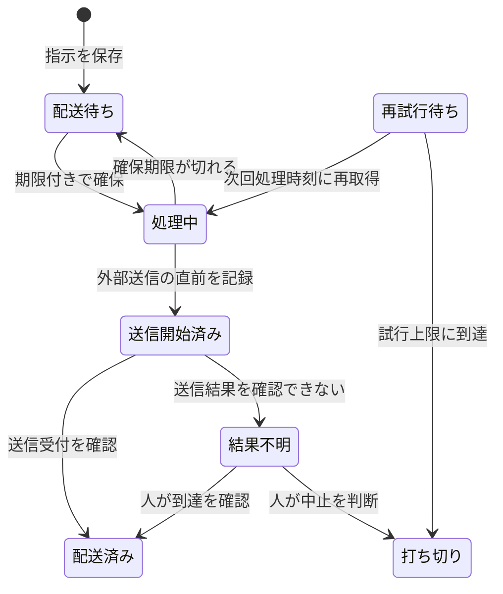

配送失敗でタスクを自動失敗にせず、配送済みでタスクを自動完了にしない。

## 複数の艦隊編成、起動コマンド、pane配置を設定する

**艦隊編成、エージェント起動プロファイル、Herdrでの起動方法、pane配置を四つの別ファイルにする。** 艦隊編成とエージェント起動プロファイルはHerdrを参照しない。Herdr起動設定だけが艦隊、版固定の表示プロファイル、必要なメンバー別エージェント起動プロファイルを参照する。他の三種類からHerdr起動設定を逆参照させない。

この境界により、Herdrを将来使わなくなっても、目的、メンバー、AI実行条件、タスク、連携規則を含む艦隊設定はそのまま残る。別の実行基盤は、自分が所有する起動設定と配置設定を用意し、同じ艦隊設定へ接続すればよい。Coreに実行基盤の登録機構を先回りして作らない。

**これら四種類の設定実体はpluginへ同梱しない。** pluginが持つのは形式、検査、解決、起動の機構だけである。通常運用では利用者領域の`~/.config/agent-fleet`だけを読み、pluginのinstall先を設定の探索先へ暗黙追加しない。repository直下の`configs`は利用者設定の開始例であり、plugin packageの一部でも既定値でもない。

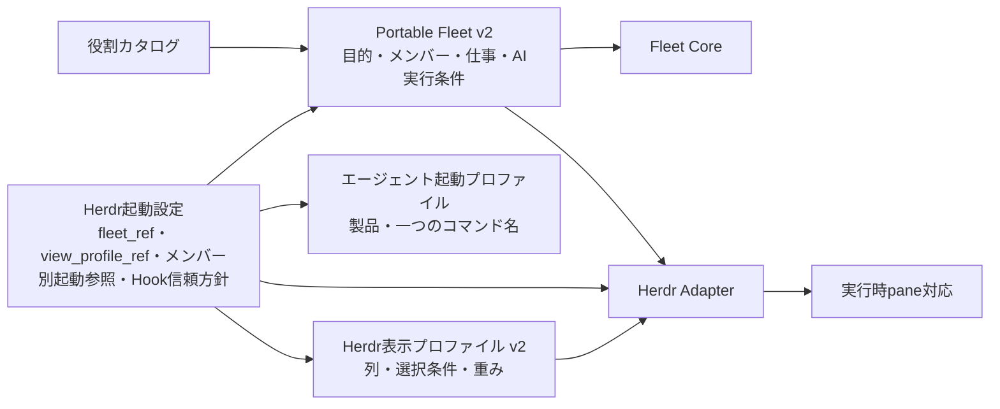

艦隊設定には目的、メンバー、担当候補、完了条件、停止条件に加え、各メンバーが使うAI製品、モデル、思考量、代替モデル方針を置く。Herdr、表示プロファイル、実際のpane番号、workspace番号、比率、設定ファイルのpathは置かない。

エージェント起動プロファイルにはAI製品と一つのコマンド名だけを置く。たとえば`codex-personal`というalias名を保持するが、そのaliasが設定する`CODEX_HOME`、`CLAUDE_CONFIG_DIR`、認証情報、モデル、Hook引数を複製しない。形式はHerdrを参照しないため、別の実行基盤も同じ識別子とコマンドを解決できる。

Herdr起動設定には起動名、対象の`fleet_ref`、版固定の`view_profile_ref`、必要な`agent_command_profiles`、艦隊専用Codex Hookの信頼方針を置く。`agent_command_profiles`はメンバーIDから版固定のエージェント起動プロファイルを引く対応であり、艦隊の役割やAI実行条件を書き換えない。`provider: herdr`はAPI版と文書種別で明らかなため重複して持たない。表示プロファイルには列、各列に入れる役割またはメンバー、重み、列内の分割方向、対応人数を置き、艦隊IDや具体的pane番号を置かない。

`agent_ref`は一つの艦隊内で一意とする。保存状態、指示、公開CLIの境界では、別艦隊の同名メンバーを混同しないよう`(fleet_id, agent_ref)`を一組の識別子として扱う。表示プロファイル内の`agent_refs`は、Herdr起動設定が選んだ一つの艦隊を対象に解決するため、`fleet_id`を重ねて書かない。

同じ起動名、または同じ表示プロファイルの識別子と版が二件見つかった場合、探索順で片方を選ばず起動を拒否する。表示内容を変える場合は既存版を上書きせず、新しい版を作る。

```yaml
# 艦隊設定
apiVersion: fleet.harness/v2
kind: Fleet
metadata:
  id: development-squad
spec:
  members:
    - agent_ref: manager
      role_ref: manager@1
      runtime:
        product: claude
        model: claude-fable-5-1
        effort: high
        fallback: fail
    - agent_ref: worker-implementation
      role_ref: worker@1
      runtime:
        product: codex
        model: gpt-5.6-sol
        effort: medium
        fallback: fail
```

`product`は起動するAI製品であり、`codex`または`claude`を指定する。Fableは別製品ではなくClaudeのモデルなので、`product: claude`とする。2026年9月2日時点の品質優先モデルは、Codexが`gpt-5.6-sol`、Claudeが`claude-fable-5-1`である。`fable`はClaude Code 2.1.255以降で最新Fableへ追従するaliasだが、艦隊の再現性を保つ開始例では正式IDを使う。根拠は[OpenAIのモデルガイド](https://developers.openai.com/api/docs/guides/latest-model)と[Claude Fable 5.1の公式資料](https://platform.claude.com/docs/en/models/fable-5-1/overview)を正本とする。

`effort`は`low`、`medium`、`high`、`xhigh`、`max`から選ぶ。Herdr連携部はCodexへ`model_reasoning_effort`、Claude Codeへ`--effort`として渡す。`fallback: fail`は、要求したモデルを別モデルへ暗黙に変えず、そのモデルを使えない場合に失敗として報告する方針である。Claude Codeには`switchModelsOnFlag: false`として渡す。製品の標準切替を許容する利用者だけが`product-default`を明示する。

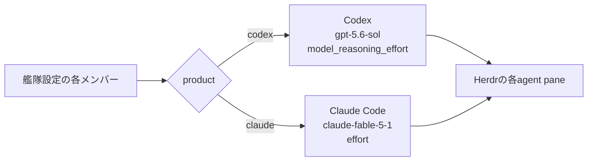

```gherkin
Scenario: 一つの艦隊でCodexとClaudeをメンバーごとに使い分ける
  Given マネージャーの実行設定はClaudeのclaude-fable-5-1とhighである
  And 作業者の実行設定はCodexのgpt-5.6-solとmediumである
  And 両メンバーの代替モデル方針はfailである
  When 利用者が艦隊の起動計画を要求する
  Then マネージャーの起動計画はClaudeとclaude-fable-5-1とhighを指定する
  And 作業者の起動計画はCodexとgpt-5.6-solとmediumを指定する
```

```gherkin
Scenario: Claude Fableを古いモデルへ暗黙に切り替えない
  Given メンバーの実行設定はClaudeのclaude-fable-5-1である
  And メンバーの代替モデル方針はfailである
  When 利用者が艦隊の起動計画を要求する
  Then Claude Codeのモデル自動切替を無効にする設定が渡される
  And 起動計画へ代替モデルは追加されない
```

```gherkin
Scenario: AI実行設定がないメンバーを含む艦隊を起動しない
  Given 艦隊FのメンバーWには役割が指定されている
  And メンバーWにはAI製品とモデルと思考量と代替モデル方針が指定されていない
  When 利用者が艦隊Fの設定を検査する
  Then 艦隊Fは起動可能な設定として受け入れられない
NOTE:
  Rule: 各メンバーのAI実行条件を艦隊設定で明示する
  Reason: 起動時の外部引数や利用者環境から実行条件を推測しないため
```

```yaml
# エージェント起動プロファイル
apiVersion: fleet.runtime.harness/v1
kind: AgentCommandProfile
metadata:
  id: local/codex-personal
  version: 1
spec:
  product: codex
  command: codex-personal
```

```yaml
# Herdr起動設定
apiVersion: fleet.herdr.harness/v1
kind: LaunchProfile
metadata:
  id: development-squad-personal
spec:
  fleet_ref: development-squad
  view_profile_ref: local/role-columns@1
  codex_hook_trust: preapproved
  agent_command_profiles:
    manager: local/claude-personal@1
    worker-implementation: local/codex-personal@1
```

```yaml
# Herdr表示プロファイル
apiVersion: fleet.herdr.harness/v2
kind: ViewProfile
metadata:
  id: local/role-columns
  version: 1
spec:
  constraints:
    min_members: 3
    max_members: 7
  layout:
    type: split
    direction: horizontal
    children:
      - type: stack
        id: management
        selector:
          role_ids: [manager]
        weight: 34
        direction: vertical
        distribution: equal
      - type: stack
        id: workers
        selector:
          role_ids: [worker]
        weight: 33
        direction: vertical
        distribution: equal
      - type: stack
        id: support
        selector:
          remaining: true
        weight: 33
        direction: vertical
        distribution: equal
```

`role_ids`は`manager@1`の`manager`部分を選ぶ表示上の分類であり、権限を決めない。マネージャーの正本は艦隊設定の`spec.collaboration.manager`である。各列の`agent_refs`を明示した場合はその順、`role_ids`を使った場合は艦隊設定のメンバー順でpaneを上から配置する。全メンバーがちょうど一つの列へ割り当たらなければ起動しない。

```gherkin
Scenario: Herdrを参照しない艦隊設定を別の実行基盤でも再利用できる
  Given 艦隊FはPortable Fleet v2として目的とメンバーと仕事を定義している
  And 艦隊FにはHerdrの名前と表示参照とpane情報がない
  When 別の実行基盤が艦隊Fを検査する
  Then 艦隊FはHerdr設定を取り除く変換なしで利用できる
NOTE:
  Rule: 艦隊の論理的な編成は実行基盤から独立させる
  Reason: Herdrを廃止しても艦隊の正本を失わないため
```

```gherkin
Scenario: Herdr起動設定が艦隊と表示プロファイルを一方向に合成する
  Given Herdr起動設定Lは艦隊Fを参照している
  And Herdr起動設定Lは版固定の表示プロファイルVを参照している
  And 表示プロファイルVは艦隊を参照していない
  When 利用者が起動名Lの計画を要求する
  Then 起動処理はFとLとVとLが参照する起動プロファイルを解決する
  And Herdr Adapterは二つの参照が実体の識別子と一致することを再検査する
```

```gherkin
Scenario: 利用者が選んだアカウント用コマンドへ艦隊の実行条件を合成する
  Given 艦隊Fの作業者WはCodexとモデルMと思考量mediumを要求している
  And 起動設定LはWを版固定の起動プロファイルcodex-personalへ対応付けている
  And codex-personalは利用者の対話シェルで利用できる
  When 利用者が起動設定Lの計画を要求する
  Then Wの起動計画はcodex-personalを最初のコマンドとして使う
  And HookとモデルMと思考量mediumの引数を同じコマンドへ合成する
  And 艦隊設定へaliasの展開内容と認証directoryを書き戻さない
```

```gherkin
Scenario: 起動プロファイルの製品と艦隊メンバーの製品が異なる間は起動しない
  Given 艦隊Fの作業者WはCodexを要求している
  And 起動設定LはWをClaude用起動プロファイルへ対応付けている
  When 利用者が起動設定Lの実行を要求する
  Then 起動処理はWと製品の不一致を示して拒否する
  And 状態directoryとSQLiteとworkspaceとpaneを作らない
```

```gherkin
Scenario: 参照した起動コマンドを対話シェルで利用できない間は起動しない
  Given 起動設定Lは作業者Wを版固定の起動プロファイルPへ対応付けている
  And Pのコマンドは利用者の対話シェルで解決できない
  When 利用者が起動設定Lの実行を要求する
  Then 起動処理は利用できないコマンド名を示して拒否する
  And workspaceとpaneを作らない
```

```gherkin
Scenario: Claude用起動コマンドが未認証の間は複数のログイン画面を作らない
  Given 起動設定Lは複数メンバーをClaude用起動コマンドclaude-personalへ対応付けている
  And claude-personalの認証状態は未ログインである
  When 利用者が起動設定Lの実行を要求する
  Then 起動処理はclaude-personalが未認証であることを一度だけ示す
  And claude-personal auth loginを先に実行するよう示す
  And workspaceとpaneを作らない
```

```gherkin
Scenario: 三つの役割群を三列へ配置する
  Given 表示プロファイルVは管理列と作業者列と支援列を左から順に定義している
  And 艦隊Fにはマネージャー1体と作業者2体と相談役とレビュー役がいる
  When Herdr AdapterがFとVから配置計画を作る
  Then マネージャーは左列を占有する
  And 二体の作業者は中央列で同じ高さに並ぶ
  And 相談役とレビュー役は右列で同じ高さに並ぶ
  And 各paneの対応は艦隊IDとメンバーIDの組で保存される
```

```gherkin
Scenario: 起動名と艦隊IDが異なっても論理状態と実行状態を混同しない
  Given Herdr起動設定Lの起動名はLで参照先の艦隊IDはFである
  And LとFは異なる識別子である
  When 利用者が起動名Lを実行する
  Then 実行記録と状態directoryは起動名Lで識別される
  And Coreのタスクと指示は艦隊ID Fで識別される
  And 艦隊制御プロセスはLの状態directoryからFだけを処理する
```

```gherkin
Scenario: 同じ艦隊を別の起動設定から同時に起動しない
  Given 艦隊FはHerdr起動設定L1から起動中である
  And Herdr起動設定L2も艦隊Fを参照している
  When 利用者がL2を実行する
  Then 起動処理はL1が起動中であることを示して拒否する
  And L2の状態directoryとworkspaceとpaneを作らない
```

```gherkin
Scenario: 起動設定と参照先が一致しない間は状態を変えない
  Given Herdr起動設定Lの艦隊参照または表示参照が実体と一致しない
  When 利用者が起動名Lの実行を要求する
  Then 起動処理は不一致の参照を示して拒否する
  And 状態directoryとSQLiteとworkspaceとpaneを作らない
```

```gherkin
Scenario: 表示条件がメンバーを重複または未割当にする間は起動しない
  Given 表示プロファイルVの列選択には重複または未割当がある
  When 利用者が起動計画を要求する
  Then 起動処理は対象メンバーを示して拒否する
  And Herdrを呼び出さない
```

```gherkin
Scenario: 起動済み配置へ同じ版名の異なる表示内容を適用しない
  Given 艦隊Fは表示プロファイルVの内容でHerdrへ配置済みである
  And Vと同じ識別子と版を持つ別内容V2が指定されている
  When Herdr AdapterがFを再度起動しようとする
  Then 起動処理は合成内容の不一致を示して拒否する
  And 既存paneを変更せず新しいpaneも作らない
```

```gherkin
Scenario: 旧Fleet v1を暗黙に新しい起動設定として扱わない
  Given 旧Fleet v1はHerdr実行設定と表示参照を内包している
  And 同じ起動名のHerdr起動設定は存在しない
  When 利用者が通常の起動コマンドを実行する
  Then 起動処理はHerdr起動設定がないことを示して拒否する
  And 利用者がlegacy-fleetを明示した場合だけ一時的な起動設定へ変換する
```

最初に利用者領域を初期化して開始例を複製し、その後は利用者側のファイルだけを編集する。

その前に`agent-roles`のSkillで、検査済みCatalogを利用者領域へ書き出す。Fleetはplugin cacheを探索せず、この明示的な固定版だけを読む。

```bash
plugins/agent-fleet-herdr/adapter/scripts/fleet-runtime init
plugins/agent-fleet-herdr/adapter/scripts/fleet-runtime doctor
mkdir -p ~/.config/agent-fleet/fleets ~/.config/agent-fleet/agent-command-profiles ~/.config/agent-fleet/herdr-launch-profiles ~/.config/agent-fleet/view-profiles
cp configs/fleets/*.yml ~/.config/agent-fleet/fleets/
cp configs/agent-command-profiles/*.yml ~/.config/agent-fleet/agent-command-profiles/
cp configs/herdr-launch-profiles/*.yml ~/.config/agent-fleet/herdr-launch-profiles/
cp configs/view-profiles/*.yml ~/.config/agent-fleet/view-profiles/
export AGENT_ROLES_CATALOG="$HOME/.config/agent-roles/catalogs/builtin@1.json"
```

一つの入口で設定の一覧、変更を伴わない計画、起動、状態確認を行う。Herdr起動設定の`metadata.id`が起動名になるため、ファイルごとの手書きスクリプトは増やさない。

```bash
plugins/agent-fleet-herdr/adapter/scripts/fleet-runtime list
```

```bash
plugins/agent-fleet-herdr/adapter/scripts/fleet-runtime plan development-squad-personal
```

```bash
plugins/agent-fleet-herdr/adapter/scripts/fleet-runtime start development-squad --execute
```

Role Catalogは`AGENT_ROLES_CATALOG`または各commandの`--role-catalog`で明示する。Core CLIが`PATH`にない場合は`--core-command`で公開CLIの絶対パスを渡すか、`AGENT_FLEET_CORE_COMMAND`へ設定する。Herdr pluginからCore pluginやRole pluginの配置は推測しない。

別の利用者設定directoryを使う場合だけ`--fleet-dir`、`--launch-dir`、`--profile-dir`を指定する。起動時の作業directoryは現在位置とする。AI製品とモデルは起動commandで艦隊全体へ外付けせず、各メンバーの`runtime`から解決する。比率を一時引数で上書きせず、再現可能な新しい表示プロファイル版として保存する。

## paneを持たない艦隊制御プロセス

**艦隊制御プロセスはエージェントではなく、判断を持たないローカル処理である。** そのためpaneを割り当てない。

`fleet-runtime start`は艦隊のpaneを作った後、同じターミナルで制御処理をforeground実行する。制御処理自身のpaneは作らず、配送対象がある間は一件処理を続け、対象がない間だけ段階的に待つ。同じFleetの制御処理はファイルロックで一つに限定する。`Ctrl-C`は制御処理だけを止め、各役割のpaneと確定済み状態を残す。同じ起動コマンドを再実行すると、paneを増やさず制御処理を再開する。

停止は起動世代から一意な操作IDを作り、Coreの役割文脈無効化に渡す。Coreは同じ操作IDの結果を再利用するため、更新後の応答だけを失って停止を再実行しても、改訂番号と履歴を二重に増やさない。停止済みの再停止は外部操作を行わない。削除は実行記録を`removing`にしてからCoreを削除し、途中で中断しても作業枠の削除を繰り返さずに完了できる。

workspaceも閉じる場合は`fleet-runtime stop <launch_id> --execute`を使う。Coreの履歴は残る。Fleet設定を作り直す場合だけ`fleet-runtime remove <launch_id> --execute`を使い、Core状態も明示的に削除する。

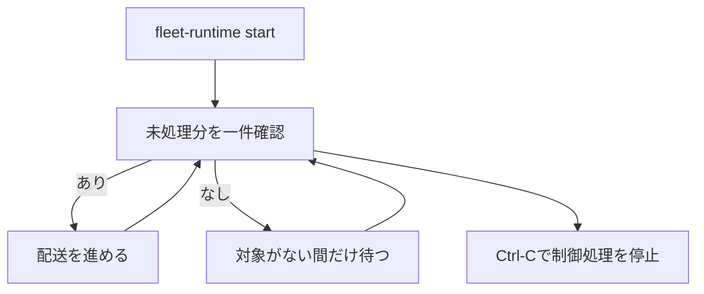

各艦隊のCore DBとHerdr対応表DBは別directoryへ保存する。これにより、一つの艦隊のロックや破損が別艦隊へ波及しない。

## 人がいつでも状態を確認する方法

**読み取り専用コマンドを使い、制御用paneは作らない。** 利用者向けには次のコマンドを使う。

```bash
plugins/agent-fleet-herdr/adapter/scripts/fleet-runtime status development-squad \
  --state-dir <状態directory>
```

このコマンドはCoreのメンバー、タスク、報告、配送件数と、Herdrの論理メンバー・pane対応、使用中の表示プロファイルを結合して返す。起動後に設定内容が変わった場合は、黙って再配置せず`configuration_drift`として示す。

## 複数艦隊を同じ端末で動かす

**状態取得と配送対象の確保は、常に艦隊IDで範囲を限定する。** 別艦隊の指示を取得してはならない。

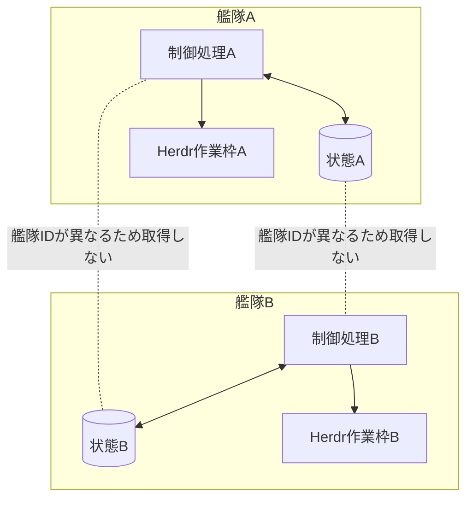

MVPは一台のMac内での複数艦隊を対象とする。別端末間でのSQLite共有、艦隊間の直接通信、独自Web UIは対象外である。

## 現在の実装と目標構成の差

**未実装部分を、現在自動で動いているものとして扱わない。**

| 項目 | 現在 | 目標 |
|---|---|---|
| 艦隊・メンバー・タスク・履歴の保存 | 実装済み | 維持 |
| 配送待ち指示 | 期限付き確保、送信開始、配送済み、結果不明、打ち切りを実装済み | 人による結果不明の解消操作を追加 |
| Herdrへの論理ID配送 | paneを持たない配送実行役から利用済み | 実Herdrの継続的な負荷検証 |
| 完了・失敗・停止の明示報告 | 節目報告と次回報告予定を含め実装済み。一回目の期限超過は担当者への状況確認、二回連続の期限超過はマネージャーへの利用者判断依頼として配送待ちへ追加する | 長時間運転で期限通知の頻度を継続検証 |
| 決定的な状態一覧 | 報告、次回報告予定、連続期限超過回数、利用者判断の要否、配送集計まで実装済み | 制御処理の最終成功時刻を追加 |
| paneを持たない艦隊制御プロセス | foreground制御と一回配送を実装済み | OS再起動後の自動復旧は未実装 |
| Herdr作業枠の作成復旧 | 作成操作ごとのランダムIDを含む専用名を作成前に記録し、台帳保存前の中断も次回起動時に一覧から一意に回収。同じ艦隊への直接操作もプロセス間ロックで直列化 | 強制終了を繰り返す実機試験 |
| 配送実行役 | 期限付き確保、送信開始記録、配送結果記録を実装済み | 人による結果不明の解消操作を追加 |
| マネージャー宛て進捗通知 | 報告保存と同時に配送待ちへ追加し、作業者の役割文脈更新より先に配送する。五体の実艦隊で受信・検査・受理まで確認済み | 継続負荷で検証 |
| 役割文脈 | 製品別Hook再注入、一回限りの役割同期、固定版の検査、通常指示のCore照合、確認済み改訂だけへの配送を実装済み | 複数会話・長時間運転を継続検証 |
| 複数編成・pane比率 | 艦隊設定、表示プロファイル、一覧・計画・起動・停止・削除・状態確認を実装済み | 明示的な再配置操作を追加 |
| マネージャーによる要約 | 役割規約として定義し、五体の実艦隊で作業報告の検査、受理、全体進捗要約を確認済み | 継続運転で検証 |

## 設計上の不変条件

1. マネージャー以外が全体進捗の意味を要約しない。
2. CoreはHerdrのpane番号を保存しない。
3. Herdr連携部はCore SQLiteを直接読まない。
4. 配送結果だけでタスクを完了・失敗へ変えない。
5. 送信結果が不明な指示を自動再送しない。
6. 同じ指示を複数の配送実行役が同時に確保しない。
7. 艦隊制御プロセスと配送実行役はpaneを持たない。
8. 人は読み取り専用コマンドで現在状態を確認できる。
9. Herdr起動設定だけが艦隊と版固定の表示プロファイルを参照し、艦隊と表示プロファイルは互いを参照しない。
10. 各指示は対象メンバーの完全な役割文脈と改訂番号を持つ。
11. `hooks.json`は固定版を起動する宣言だけを持ち、役割同期の実処理を持たない。
12. 起動済み艦隊は記録済みの固定版を検査して使い、プラグイン更新へ暗黙追従しない。
13. Coreが現在の役割改訂の受領を確認するまで、通常指示を配送しない。
14. 役割Hookは艦隊agent sessionだけに登録し、普通に起動したCodexとClaude Codeでは実行しない。

## 関連資料

- [作業進行ルール](2026-08-31-エージェント艦隊-作業進行ルール.md) — 誰が報告、要約、判断を担うか
- [非機能要件](2026-08-31-エージェント艦隊-非機能要件.md) — 待ち時間、並行実行、復旧、計測方法
- [役割Hookの実行契機と責務](2026-09-01-エージェント艦隊-役割Hookの実行契機と責務.md) — セッション開始時とprompt送信時の処理
- [Fleet Core](../plugins/agent-fleet-core/core/SKILL.md) — 現行Coreの公開操作
- [Herdr連携部](../plugins/agent-fleet-herdr/adapter/SKILL.md) — 現行Herdr連携の公開操作
