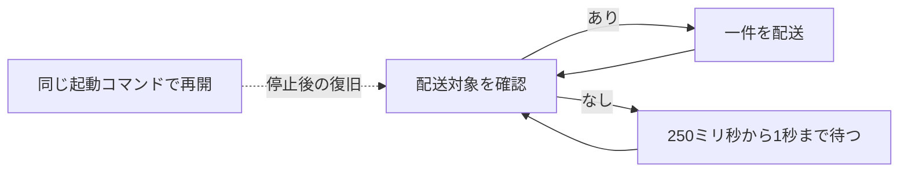
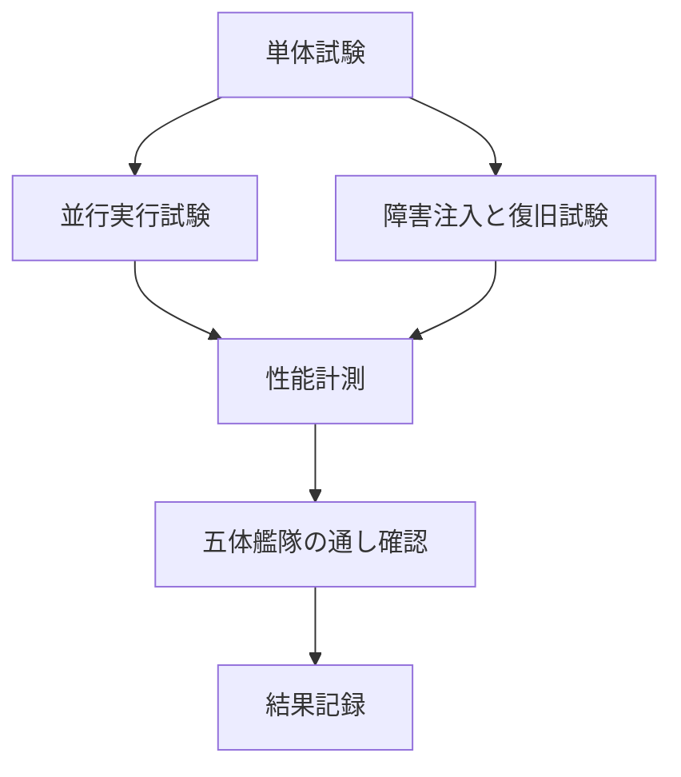

# エージェント艦隊における非機能要件

この資料は、エージェント艦隊の待ち時間、並行実行、復旧、整合性、観測可能性をどの水準で保証し、どのように計測するかを定める。

> 起動中の制御処理は、配送対象がある間は直ちに次を処理する。対象がない間は250ミリ秒から1秒まで段階的に待ち、低負荷と反応時間を両立する。

## 文書の位置づけ

**この資料は業務ルールではなく、実装と運用が満たす品質基準である。** 誰が報告し誰が要約するかは[作業進行ルール](2026-08-31-エージェント艦隊-作業進行ルール.md)、連携方法は[艦隊制御アーキテクチャ](2026-08-31-エージェント艦隊-連携と全体制御.md)を正本とする。

目標、計測条件、合格判定、現在の実測を分ける。目標値を決めただけの項目を「達成済み」と表現しない。

## 対象範囲

- 一台のMac上で動くローカル艦隊を対象とする。
- 標準構成はマネージャー1体、作業者2体、助言役1体、確認役1体とする。
- 同時に3艦隊まで起動する基準で計測する。
- CoreとHerdr連携部は同じ端末上に置く。
- SQLiteはローカルディスクへ置き、ネットワーク共有しない。
- エージェントが回答を生成する時間は、配送遅延と分けて計測する。

複数端末で一つの状態を共有する構成、インターネット越しの配送、独自Web UIの応答性能は対象外である。

## 性能目標

**通常時の待ち時間を定期実行の間隔に依存させない。** 各目標は100回以上の標本に対する95パーセンタイルで判定する。

| 識別子 | 対象 | 開始点 | 終了点 | 目標 |
|---|---|---|---|---:|
| 性能-01 | 報告から通知作成 | 作業報告の保存要求を受けた時刻 | マネージャー宛て通知が配送待ちになった時刻 | p95 100ミリ秒以内 |
| 性能-02 | Herdr経由の配送 | 配送対象を確保した時刻 | Herdrが送信を受け付けた時刻 | p95 1秒以内 |
| 性能-03 | 状態確認 | `status`処理を開始した時刻 | 状態一覧のJSON出力が完了した時刻 | p95 200ミリ秒以内 |
| 性能-04 | 次の配送確認 | 指示や報告の保存が確定した時刻 | 艦隊制御の一回処理が開始した時刻 | p95 1.2秒以内 |
| 性能-05 | 復旧用回収 | 復旧用の一回処理が開始した時刻 | 未処理件数が確定した時刻 | p95 500ミリ秒以内 |

平均値は一部の遅い処理を隠せるため、合否に使わない。中央値、p95、最大値を記録し、p95を合否に使う。

## 計測条件

**性能値には再現可能な条件を添える。**

| 項目 | 標準条件 |
|---|---:|
| 艦隊数 | 3 |
| 1艦隊のメンバー数 | 5 |
| 1艦隊のタスク数 | 100 |
| 1タスクの報告数 | 20 |
| 1艦隊の履歴数 | 5,000 |
| 未処理の配送待ち件数 | 通常10、負荷時1,000 |
| 反復回数 | 事前実行10回の後に100回以上 |

計測時はmacOS、Python、CPU、メモリ、SQLiteの置き場所、同時実行数、dry-runか実Herdrか、標本数、中央値、p95、最大値、成功・失敗・結果不明件数を記録する。

測定値を小さい順に並べ、`ceil(標本数 × 0.95) - 1`番目をp95とする。単位はミリ秒で統一する。

## 待ち時間を増やさない制御

**foregroundの制御処理は配送対象がある間は待たず、対象がない状態が続くと250ミリ秒、500ミリ秒、1秒へ待ち時間を伸ばす。** 配送後は250ミリ秒へ戻すため、複数の指示が並んでも待ち時間を積み上げない。

Hookの通常時目標は1秒以内とする。一方、Coreの照合と受領確定を順番に実行し、それぞれで応答を失った場合の一回再照合とローカルSQLiteの競合待ちまで完了できるよう、製品側の強制終了上限は12秒とする。Core呼び出しは最大8秒、受領前のローカルSQLite待ちは最大2秒であり、残りをprocess起動と応答処理の余裕にする。Core確定後の補助印は待たずに保存を試みる。この上限は通常時の待ち時間ではなく、障害時に指示の確定有無を曖昧にしないための猶予である。



`Ctrl-C`や端末終了後は自動巡回せず、同じ起動コマンドで制御処理を再開する。OS起動時の自動復旧は未実装であり、実装する場合もエージェント用paneを制御処理へ割り当てない。

## 並行実行と整合性

**複数の配送実行役が動いても、一つの指示を同時に処理しない。**

| 識別子 | 条件 | 合格基準 |
|---|---|---|
| 並行-01 | 配送実行役を2個同時に開始する | 同じ指示を確保する処理は一つだけ |
| 並行-02 | 同じ報告を同時に2回保存する | 報告と進捗上の効果は一件だけ |
| 並行-03 | 3艦隊から同時に配送対象を取得する | 指定した艦隊の指示だけを取得する |
| 並行-04 | 状態更新中に`status`を実行する | 途中状態や壊れたJSONを返さない |
| 並行-05 | Coreへの書き込みが競合する | 5秒以内に成功するか、再実行可能な失敗を返す |
| 並行-06 | 同じ艦隊へHerdr連携部を直接2個同時実行する | 一つ目だけが作業枠を作り、二つ目は保存済み状態を返す |

SQLiteのロック方式は実装手段であり、この表は外から観測できる結果を定める。

## 障害復旧

**停止した場所ごとに、残す状態と再開方法を固定する。**

| 障害点 | 残すべき状態 | 復旧後 | 自動再送 |
|---|---|---|---|
| 指示保存前 | タスク更新も配送待ち指示も成立しない | マネージャーが再度判断する | 対象外 |
| 指示保存後・配送前 | タスク更新と配送待ち指示 | 未配送分を回収する | 行う |
| 確保後・送信前 | 確保期限と指示 | 期限後に配送待ちへ戻す | 行う |
| 送信後・結果記録前 | 結果不明 | 人が到達を確認する | 行わない |
| Herdr作業枠の作成後・台帳保存前 | 作成操作ごとのランダムIDを含む専用名を持つ作成意図 | 次回起動で一覧照合し、今回の一意な作業枠だけを閉じて作り直す | 対象外 |
| 報告保存後・通知前 | 報告と通知対象 | 未通知分を回収する | 行う |
| マネージャー停止中 | 報告と未確認状態 | 復帰後に状態一覧から再開する | 配送規則に従う |

復旧試験では各障害点で処理を中断し、再起動後の状態、重複の有無、次に可能な操作を確認する。

起動名と艦隊IDは別の識別子であるため、起動・停止・削除は両方のロックを固定順序で取得する。停止要求は進捗を表す実行記録へ書き込まず、停止完了まで残る永続キャンセルとして分離する。起動処理はCore、Herdr、担当設定、役割同期の各境界でこの要求を確認する。各外部処理の発行を線形化点とし、発行前に停止要求を確認できた処理は開始しない。確認直後に停止要求が届き、すでにsubprocessへ発行した処理は途中で打ち切らず、完了結果を照合してから停止処理が役割文脈の無効化とHerdr作業枠の回収を行う。停止側がロック待ちで時間切れになった場合や異常終了した場合も要求を残し、起動の継続を拒否する。停止の再実行が整合化まで成功した時だけ要求を除去する。

## 可用性とデータ保持

**停止しないことより、停止後に説明可能な状態へ戻れることを優先する。**

- 正常終了と異常終了のどちらでも、確定済みのタスク状態、報告、配送待ち指示、履歴を失わない。
- 履歴は削除処理を明示するまで保持する。
- SQLite破損時は自動修復せず、読み取り専用の診断結果と復元手順を示す。
- 日次バックアップは選択可能にするが、MVPの自動実行要件には含めない。
- マネージャーやHerdrを再起動しても、論理エージェントID、担当、タスク状態を変えない。

## 固定実行版と外部前提

**艦隊の実行中に暗黙の版更新を混ぜない。** 新規起動では、Coreとvalidator資源、Herdr連携部とそのimport先、配送制御、`role_context.py`、Claude用Hook登録を一時固定版で検査する。検査成功後だけ艦隊stateへ内容address付きで公開し、起動、制御処理の再開、停止、削除は保存済み固定版を検査して使う。停止後の再起動だけが現在版への切替境界である。

`fleet-runtime`自身は固定実行物を検査・選択する制御境界であり、固定実行版には含めない。`python3`、Herdr 0.8.x、Codex・Claude CLIと認証、Codexの`agent-fleet-session-hooks@agent-fleet`名前解決も外部前提である。Codexは新しい作業枠を作る前にこの登録を検査し、登録宣言から固定済み`role_context.py`へ制御を渡す。起動済み作業枠の制御処理を再開するだけなら、現在のCodex登録を再解決しない。

状態領域は利用者本人だけが書き込むsame-UID前提とする。その下の`execution-runtimes`と`hook-runtimes`は所有者とmodeを検査し、symlink、hard link、予期しないfile、書き込み可能な固定版を拒否する。同same-UIDの別processが状態領域の上位directoryそのものを同時に差し替える攻撃までは防御範囲に含めない。利用者領域は`0700`を維持し、複数利用者の共有領域へ置かない。

## 観測可能性

**paneへ入らなくても、止まっている場所を判別できる情報を返す。**

- 艦隊ごとのメンバーとタスク状態
- 最後の作業報告時刻と次回報告予定
- 報告期限を過ぎたタスク
- 配送待ち、処理中、再試行待ち、配送済み、結果不明、打ち切りの件数
- 最後に艦隊制御処理が成功した時刻
- 最後の失敗箇所と再実行可否
- 各処理の所要時間
- 現在の役割文脈改訂と、Hookが保持する会話ごとの関連状態
- 起動時の艦隊設定・表示プロファイルの内容差異

ログには艦隊ID、処理ID、指示ID、タスクID、論理エージェントID、開始・終了時刻、結果を含める。指示本文や成果物全文は既定で性能ログへ記録しない。

## 安全性

- 結果不明の配送を自動再送しない。
- 読み取り専用の状態確認はデータを変更しない。
- CoreへHerdr操作権限を追加しない。
- 艦隊制御プロセスに全体進捗の意味判断を持たせない。
- paneの待機表示や出力量からタスク完了を推測しない。
- 性能目標を超えても、履歴や整合性検査を省略しない。
- Hooksが未承認または無効なら、現在の改訂を確認するまで通常指示を配送しない。通常指示もCoreに保存された内容、宛先、受信sessionと照合できなければ処理しない。
- 起動中の設定内容が変わっても、既存paneを暗黙に再配置しない。

## 品質基準としての代表的な振る舞い

技術方式ではなく、利用者と運用者が外から確認できる結果をGiven／When／Thenで固定する。

```gherkin
Scenario: 配送対象が続く間は待機を挟まない
  Given 艦隊Fに未配送の指示が複数ある
  When 艦隊制御プロセスが一件の配送処理を終える
  Then 艦隊制御プロセスは待機せず次の配送対象を確認する
```

```gherkin
Scenario: 配送対象がない間だけ待機時間を段階的に伸ばす
  Given 艦隊Fに配送対象がない
  When 艦隊制御プロセスが連続して配送対象なしを確認する
  Then 待機時間は250ミリ秒から500ミリ秒と1秒まで段階的に伸びる
  And 1秒を超えて伸びない
```

```gherkin
Scenario: 配送後は次の空振り待機を250ミリ秒へ戻す
  Given 艦隊制御プロセスの空振り待機が1秒まで伸びている
  And 艦隊Fに新しい配送対象がある
  When 艦隊制御プロセスがその配送処理を終える
  Then 次に配送対象がない場合の待機時間は250ミリ秒になる
```

```gherkin
Scenario: 二つの配送実行役でも一つの指示は一度だけ確保される
  Given 艦隊Fに未配送の指示Cが一件ある
  When 二つの配送実行役が同時に指示を確保する
  Then 指示Cを確保する配送実行役は一つだけである
  And 指示Cの処理回数は一回のまま維持される
```

```gherkin
Scenario: 送信開始前に失効した確保を別の配送実行役が回収する
  Given 配送実行役D1は指示Cを確保している
  And D1は外部送信を開始せずに確保期限を過ぎている
  When 配送実行役D2が次の配送対象を要求する
  Then D2は新しい確保番号で指示Cを取得できる
  And D1の古い確保番号では送信開始も結果記録もできない
```

```gherkin
Scenario: 送信開始後に結果を失った指示を再送しない
  Given 配送実行役D1は指示Cの外部送信を開始している
  And D1は配送結果を記録する前に停止している
  When 確保期限後に配送処理を再開する
  Then 指示Cは結果不明として示される
  And 指示Cは自動で再送されない
```

```gherkin
Scenario: 制御処理の停止後も艦隊の作業枠と確定状態を残す
  Given 艦隊Fの制御処理と五つの作業枠が起動している
  When 利用者が制御処理を停止する
  Then 五つの作業枠は維持される
  And 確定済みのタスクと報告と配送状態は維持される
```

```gherkin
Scenario: 同じ起動コマンドで未配送分から再開する
  Given 艦隊Fの制御処理は停止している
  And 艦隊Fには未配送の指示が残っている
  When 利用者が同じ艦隊Fの起動コマンドを実行する
  Then 既存の艦隊状態から制御処理が再開する
  And 未配送の指示が次の配送対象になる
```

```gherkin
Scenario: 三艦隊を同時処理しても指示を混入させない
  Given 艦隊F1とF2とF3にそれぞれ配送対象がある
  When 三艦隊の配送処理を同時に実行する
  Then 各配送実行役は指定された艦隊の指示だけを取得する
  And 他の艦隊の作業枠へ指示を届けない
```

```gherkin
Scenario: 状態確認は管理対象を変更しない
  Given 艦隊Fにタスクと報告と配送状態が保存されている
  When 利用者が艦隊Fの状態を確認する
  Then 状態一覧は整合したJSONとして返る
  And タスクと報告と配送状態は変更されない
```

```gherkin
Scenario: 起動前の検査中に設定が変わった場合は状態を作らない
  Given 起動処理は艦隊設定と起動設定と表示プロファイルを組み合わせている
  And 組み合わせの検査中または実行前確認中にいずれかの内容が変わる
  When 起動処理が状態を書き始めようとする
  Then 起動処理は変更された設定を示して拒否する
  And 状態directoryとSQLiteとworkspaceとpaneを作らない
```

```gherkin
Scenario: 真偽値を表示プロファイルの版番号として扱わない
  Given 表示プロファイルの版番号に真偽値が指定されている
  When 起動処理が表示プロファイルの識別子を解決する
  Then 起動処理は正の整数ではない版番号として拒否する
  And 艦隊状態もHerdrの作業枠も作らない
```

```gherkin
Scenario: 実行できない制御処理を含む固定版では状態を作らない
  Given fleet-controllerを含む実行物と役割Hookを一時固定版へ複製している
  And fleet-controllerの副作用なし起動または役割Hookの構文検査またはClaude用Hook登録の形式検査に失敗する
  When 利用者が艦隊を起動する
  Then fleet-runtimeは失敗理由を示して起動を拒否する
  And 艦隊状態もHerdrの作業枠も作らない
```

```gherkin
Scenario: 起動途中の停止要求を進捗更新で失わない
  Given 艦隊Fの起動処理は起動前検査中またはCoreの準備中である
  And 利用者の停止処理は起動処理と同じ起動名と艦隊IDを対象にする
  When 停止処理が起動完了前に停止を要求する
  Then 停止要求を確認した後の未発行操作は開始しない
  And すでに発行済みの外部処理は完了結果を照合してから停止処理が整合させる
  And 停止側の待機が時間切れになっても要求を残して起動の継続を拒否する
  And 実行記録があれば停止済みにし実行記録がなければ未稼働として完了する
```

```gherkin
Scenario: 停止済みの艦隊を再度停止しても外部操作を繰り返さない
  Given 艦隊Fの実行記録は停止済みである
  When 利用者が艦隊Fの停止を再実行する
  Then 停止処理は成功を返す
  And Coreの役割文脈無効化を繰り返さない
  And Herdrの作業枠削除を繰り返さない
```

```gherkin
Scenario: 削除中断後に同じ削除を完了させる
  Given 艦隊Fは作業枠を停止し削除中の実行記録を残している
  And Coreの艦隊削除が完了したかは不明である
  When 利用者が艦隊Fの削除を再実行する
  Then Herdrの作業枠削除は繰り返さない
  And Coreの艦隊削除は未削除と削除済みのどちらでも成功する
  And 実行記録を削除して完了する
```

```gherkin
Scenario: 固定実行版の改ざんを実行前に拒否する
  Given 艦隊Fは各fileの内容ハッシュとmodeを記録した固定実行版を持つ
  And 固定実行版に予期しないfileまたはmode変更がある
  When 利用者が状態確認または制御処理の再開を実行する
  Then fleet-runtimeは固定実行版の不一致を示して拒否する
  And CoreとHerdr連携部と配送制御を実行しない
```

```gherkin
Scenario: 起動中に導入元の実行物が変わっても固定版だけを使う
  Given 艦隊FはCoreとHerdr連携部と制御処理の実行物を固定版へ複製済みである
  And 起動処理の途中でplugin導入元の実行物が変わる
  When 起動処理が次の副作用または継続監視へ進む
  Then 起動処理は起動時に検査した固定版だけを実行する
  And 変更後の導入元を検査前の同一性で実行しない
```

```gherkin
Scenario: 期限確認の一時失敗でも保存済み指示の配送を止めない
  Given 艦隊Fには未配送の指示Cがある
  And 報告期限の確認は一時的に失敗している
  When 艦隊制御プロセスが一回の処理を行う
  Then 指示Cは通常どおり配送対象になる
  And 期限確認の失敗は警告として確認できる
```

```gherkin
Scenario: 標準負荷で報告通知と状態確認の目標を判定する
  Given 三艦隊に標準条件のメンバーとタスクと報告が保存されている
  And 事前実行を十回終えている
  When 報告通知作成と状態確認をそれぞれ百回計測する
  Then 報告通知作成のp95は100ミリ秒以内である
  And 状態確認のp95は200ミリ秒以内である
```

## 検証計画

**単体、並行実行、障害復旧、性能を分けて測り、最後に五体の実艦隊で通す。**



### 検証項目

- 担当者だけがタスク状態を報告できる。
- 状態一覧は同じ状態から同じ順序と内容を返す。
- 二つの配送実行役が同じ指示を確保しない。
- 同じ報告の同時保存で効果が重複しない。
- 三艦隊の同時処理で指示が混入しない。
- 指示保存直後、確保直後、送信直後、報告保存直後の停止から回復する。
- マネージャー停止中の複数報告を復帰後に確認できる。

### 五体艦隊の通し確認

1. マネージャーが二つの作業を並行して割り当てる。
2. 作業者が開始と節目を報告する。
3. 助言役が懸念と代案を報告する。
4. 確認役が一方の成果を差し戻す。
5. マネージャーが状態一覧を解釈し、修正指示を出す。
6. 修正後に確認役が合格を報告する。
7. マネージャーが全体進捗を要約し、成果を受容する。

## 合格判定

- 全単体試験が成功する。
- 並行実行で重複処理と艦隊間混入がない。
- 障害復旧で確定済み事実を失わない。
- 性能-01から性能-05までp95目標を満たす。
- 五体艦隊で各役割の報告からマネージャーが全体進捗を作れる。
- 状態確認コマンドだけで停止箇所と未処理件数を判別できる。

## 現在の検証状況

**2026年9月1日時点では、自動試験とdry-run統合試験に加え、五体の実Herdr/Codex艦隊で役割同期、助言作業、節目・完了報告、マネージャー通知、検査、受容、依存タスク解放まで成功している。** Herdr開始観測後の結果不明が遅着Hook受領で配送済みへ訂正されること、マネージャー通知が作業者の文脈更新より先に届くこと、配送中の安全停止、新しい起動世代・新sessionへの役割再同期、停止前の旧session拒否、停止・削除まで実機確認した。標準データ量の三艦隊を使う100標本では性能-01、性能-03、性能-04のCore処理部分が合格した。実Herdrを含む性能-02、性能-04全体、性能-05の100標本と、五体全員が成果を受け渡す長時間計測は未実施である。

2026年9月4日には、設定三文書の分離、三列配置、起動名と艦隊IDの二重排他、起動途中の停止、固定実行版、停止・削除の再実行、Codex Hook登録の事前検査を自動試験とdry-run統合試験で再検証した。同じ日に標準データ量の100標本を再計測した。

| 項目 | 状態 | 根拠・不足 |
|---|---|---|
| Core Spec単体試験 | 合格、24件 | 2026年9月4日に`scripts/validate.sh`を実行 |
| Core runtime単体試験 | 合格、64件 | 2026年9月4日に`scripts/validate.sh`を実行 |
| Herdr連携・Hooks・起動処理単体試験 | 合格、171件 | 2026年9月4日に`scripts/validate.sh`を実行 |
| BDDと自動試験の対応検査 | 合格、90シナリオ | 四資料の全GWTが自動試験または計測処理と対応することを検査 |
| dry-run統合試験 | 合格 | 2026年9月4日に`scripts/validate.sh`を実行 |
| `status`性能 | 合格、100標本 | 中央値53.524ミリ秒、p95 56.842ミリ秒、最大59.792ミリ秒 |
| 報告から通知作成 | 合格、100標本 | 中央値0.716ミリ秒、p95 0.897ミリ秒、最大1.036ミリ秒 |
| Herdr配送性能 | 機能試験済み、性能未計測 | 実Herdrで100回以上の計測が必要 |
| 期限確認のCore処理時間 | 合格、100標本 | 中央値1.313ミリ秒、p95 1.412ミリ秒、最大1.963ミリ秒。性能-04全体のうちCore処理部分であり、実Herdrを含む全体値とは分ける |
| 並行実行 | 期限付き確保、同一艦隊への直接provision直列化、艦隊IDによる分離を単体試験済み。性能計測では三艦隊の標準データを使用 | 三艦隊から実Herdrへ同時配送する負荷試験が必要 |
| 障害復旧 | 送信前後の状態遷移、台帳保存前のHerdr作業枠回収を単体試験し、実workspaceの起動失敗回収、配送中の停止、新世代での再起動、既消失workspaceの停止を確認 | 強制終了を繰り返す負荷試験が必要 |
| 五体艦隊の通し確認 | 合格、主要経路 | 五体の同期、助言役の実作業、報告、マネージャーの検査・受容、依存する実装タスク解放を実Herdrで確認。全員による長時間連鎖は未計測 |
| 役割文脈の確認済み改訂による配送制限 | 合格 | 未確認時の停止、現在改訂の確認、古い改訂の拒否を単体試験済み |
| 役割文脈と通常指示の真正性 | 合格 | 一回限りの役割同期と、Core保存内容・宛先・受信sessionの照合を単体・実機確認 |

計測環境はmacOS 26.6.2 arm64、Python 3.14.6、SQLite 3.53.4、ローカル一時領域のWALである。再計測は[非機能要件の計測スクリプト](../scripts/benchmark_nfr.py)を使う。

## 関連資料

- [作業進行ルール](2026-08-31-エージェント艦隊-作業進行ルール.md) — 業務上の役割と判断
- [艦隊制御アーキテクチャ](2026-08-31-エージェント艦隊-連携と全体制御.md) — 構成要素と通信の流れ
- [役割Hookの実行契機と責務](2026-09-01-エージェント艦隊-役割Hookの実行契機と責務.md) — Hookの実行時点、失敗時の制御、製品差
- [検証スクリプト](../scripts/validate.sh) — 現行MVPの単体・dry-run統合試験
- [非機能要件の計測スクリプト](../scripts/benchmark_nfr.py) — 三艦隊の標準データ生成と性能-01・性能-03・性能-04のCore処理部分の100標本計測
