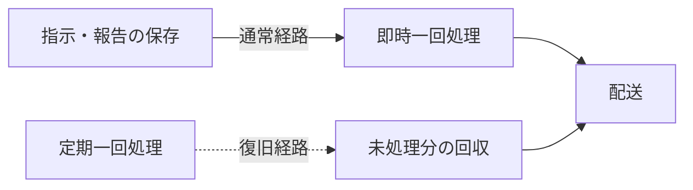
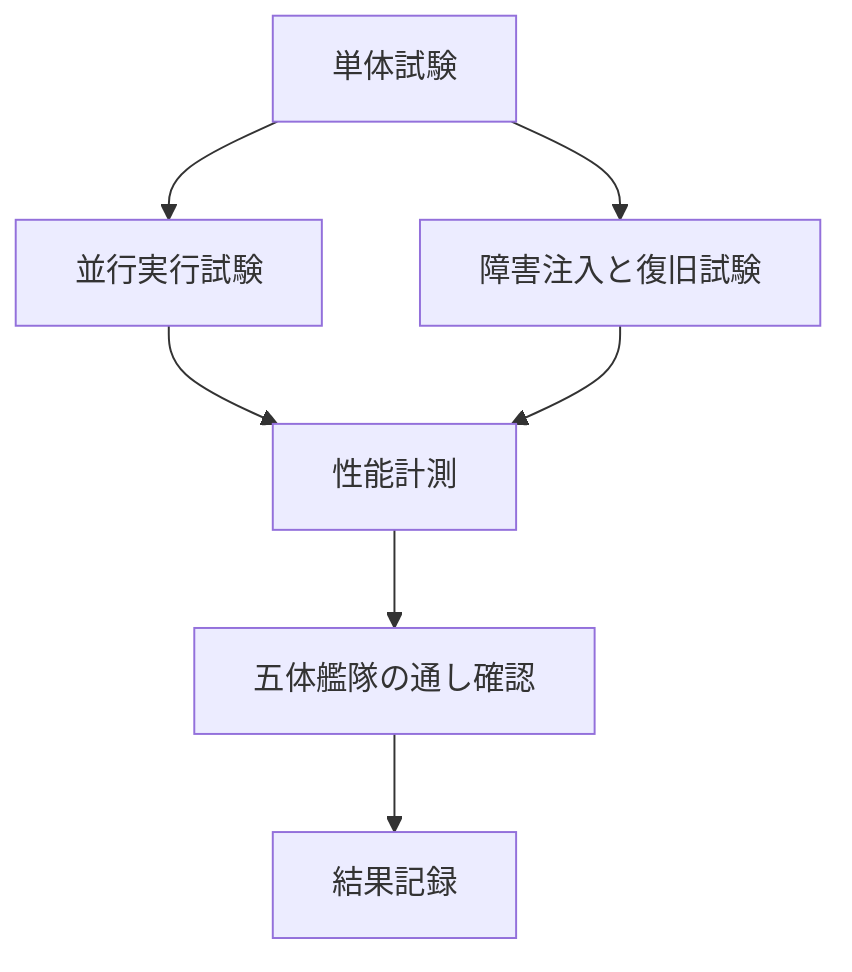

# エージェント艦隊における非機能要件

この資料は、エージェント艦隊の待ち時間、並行実行、復旧、整合性、観測可能性をどの水準で保証し、どのように計測するかを定める。

> 通常経路は新しい指示や報告を契機に即時処理し、定期実行は復旧専用とする。体感待ちを増やさず、停止後も未処理分を回収できることを両立する。

## 文書の位置づけ

**この資料は業務ルールではなく、実装と運用が満たす品質基準である。** 誰が報告し誰が要約するかは[作業進行ルール](2026-08-31-エージェント艦隊-作業進行ルール.md)、連携方法は[艦隊制御アーキテクチャ](2026-08-31-エージェント艦隊-連携と全体制御.md)を正本とする。

目標、計測条件、合格判定、現在の実測を分ける。目標値を決めただけの項目を「達成済み」と表現しない。

## 対象範囲

- 一台のMac上で動くローカル艦隊を対象とする。
- 標準構成はマネージャー1体、作業者2体、助言役1体、確認役1体とする。
- 同時に3艦隊まで起動する基準で計測する。
- CoreとHerdr連携部は同じ端末上に置く。
- SQLiteはローカルディスクへ置き、ネットワーク共有しない。
- エージェントが回答を生成する時間は、配送遅延と分けて計測する。

複数端末で一つの状態を共有する構成、インターネット越しの配送、独自Web UIの応答性能は対象外である。

## 性能目標

**通常時の待ち時間を定期実行の間隔に依存させない。** 各目標は100回以上の標本に対する95パーセンタイルで判定する。

| 識別子 | 対象 | 開始点 | 終了点 | 目標 |
|---|---|---|---|---:|
| 性能-01 | 報告から通知作成 | 作業報告の保存要求を受けた時刻 | マネージャー宛て通知が配送待ちになった時刻 | p95 100ミリ秒以内 |
| 性能-02 | Herdr経由の配送 | 配送対象を確保した時刻 | Herdrが送信を受け付けた時刻 | p95 1秒以内 |
| 性能-03 | 状態確認 | `status`処理を開始した時刻 | 状態一覧のJSON出力が完了した時刻 | p95 200ミリ秒以内 |
| 性能-04 | 即時処理の起動 | 指示や報告の保存が確定した時刻 | 艦隊制御の一回処理が開始した時刻 | p95 100ミリ秒以内 |
| 性能-05 | 復旧用回収 | 復旧用の一回処理が開始した時刻 | 未処理件数が確定した時刻 | p95 500ミリ秒以内 |

平均値は一部の遅い処理を隠せるため、合否に使わない。中央値、p95、最大値を記録し、p95を合否に使う。

## 計測条件

**性能値には再現可能な条件を添える。**

| 項目 | 標準条件 |
|---|---:|
| 艦隊数 | 3 |
| 1艦隊のメンバー数 | 5 |
| 1艦隊のタスク数 | 100 |
| 1タスクの報告数 | 20 |
| 1艦隊の履歴数 | 5,000 |
| 未処理の配送待ち件数 | 通常10、負荷時1,000 |
| 反復回数 | 事前実行10回の後に100回以上 |

計測時はmacOS、Python、CPU、メモリ、SQLiteの置き場所、同時実行数、dry-runか実Herdrか、標本数、中央値、p95、最大値、成功・失敗・結果不明件数を記録する。

測定値を小さい順に並べ、`ceil(標本数 × 0.95) - 1`番目をp95とする。単位はミリ秒で統一する。

## 待ち時間を増やさない制御

**通常処理は保存を契機に起動し、一定間隔の巡回を待たない。** 定期実行はOS休止、異常終了、起動失敗から回復するためだけに使う。

復旧用の実行間隔は性能目標に含めない。通常経路が壊れた際に未処理が残る時間を決める運用値として、初期値は30秒とする。

## 並行実行と整合性

**複数の配送実行役が動いても、一つの指示を同時に処理しない。**

| 識別子 | 条件 | 合格基準 |
|---|---|---|
| 並行-01 | 配送実行役を2個同時に開始する | 同じ指示を確保する処理は一つだけ |
| 並行-02 | 同じ報告を同時に2回保存する | 報告と進捗上の効果は一件だけ |
| 並行-03 | 3艦隊から同時に配送対象を取得する | 指定した艦隊の指示だけを取得する |
| 並行-04 | 状態更新中に`status`を実行する | 途中状態や壊れたJSONを返さない |
| 並行-05 | Coreへの書き込みが競合する | 5秒以内に成功するか、再実行可能な失敗を返す |

SQLiteのロック方式は実装手段であり、この表は外から観測できる結果を定める。

## 障害復旧

**停止した場所ごとに、残す状態と再開方法を固定する。**

| 障害点 | 残すべき状態 | 復旧後 | 自動再送 |
|---|---|---|---|
| 指示保存前 | タスク更新も配送待ち指示も成立しない | マネージャーが再度判断する | 対象外 |
| 指示保存後・配送前 | タスク更新と配送待ち指示 | 未配送分を回収する | 行う |
| 確保後・送信前 | 確保期限と指示 | 期限後に配送待ちへ戻す | 行う |
| 送信後・結果記録前 | 結果不明 | 人が到達を確認する | 行わない |
| 報告保存後・通知前 | 報告と通知対象 | 未通知分を回収する | 行う |
| マネージャー停止中 | 報告と未確認状態 | 復帰後に状態一覧から再開する | 配送規則に従う |

復旧試験では各障害点で処理を中断し、再起動後の状態、重複の有無、次に可能な操作を確認する。

## 可用性とデータ保持

**停止しないことより、停止後に説明可能な状態へ戻れることを優先する。**

- 正常終了と異常終了のどちらでも、確定済みのタスク状態、報告、配送待ち指示、履歴を失わない。
- 履歴は削除処理を明示するまで保持する。
- SQLite破損時は自動修復せず、読み取り専用の診断結果と復元手順を示す。
- 日次バックアップは選択可能にするが、MVPの自動実行要件には含めない。
- マネージャーやHerdrを再起動しても、論理エージェントID、担当、タスク状態を変えない。

## 観測可能性

**paneへ入らなくても、止まっている場所を判別できる情報を返す。**

- 艦隊ごとのメンバーとタスク状態
- 最後の作業報告時刻と次回報告予定
- 報告期限を過ぎたタスク
- 配送待ち、処理中、再試行待ち、配送済み、結果不明、打ち切りの件数
- 最後に艦隊制御処理が成功した時刻
- 最後の失敗箇所と再実行可否
- 各処理の所要時間

ログには艦隊ID、処理ID、指示ID、タスクID、論理エージェントID、開始・終了時刻、結果を含める。指示本文や成果物全文は既定で性能ログへ記録しない。

## 安全性

- 結果不明の配送を自動再送しない。
- 読み取り専用の状態確認はデータを変更しない。
- CoreへHerdr操作権限を追加しない。
- 艦隊制御プロセスに全体進捗の意味判断を持たせない。
- paneの待機表示や出力量からタスク完了を推測しない。
- 性能目標を超えても、履歴や整合性検査を省略しない。

## 検証計画

**単体、並行実行、障害復旧、性能を分けて測り、最後に五体の実艦隊で通す。**

### 検証項目

- 担当者だけがタスク状態を報告できる。
- 状態一覧は同じ状態から同じ順序と内容を返す。
- 二つの配送実行役が同じ指示を確保しない。
- 同じ報告の同時保存で効果が重複しない。
- 三艦隊の同時処理で指示が混入しない。
- 指示保存直後、確保直後、送信直後、報告保存直後の停止から回復する。
- マネージャー停止中の複数報告を復帰後に確認できる。

### 五体艦隊の通し確認

1. マネージャーが二つの作業を並行して割り当てる。
2. 作業者が開始と節目を報告する。
3. 助言役が懸念と代案を報告する。
4. 確認役が一方の成果を差し戻す。
5. マネージャーが状態一覧を解釈し、修正指示を出す。
6. 修正後に確認役が合格を報告する。
7. マネージャーが全体進捗を要約し、成果を受容する。

## 合格判定

- 全単体試験が成功する。
- 並行実行で重複処理と艦隊間混入がない。
- 障害復旧で確定済み事実を失わない。
- 性能-01から性能-05までp95目標を満たす。
- 五体艦隊で各役割の報告からマネージャーが全体進捗を作れる。
- 状態確認コマンドだけで停止箇所と未処理件数を判別できる。

## 現在の検証状況

**2026年9月1日時点では、既存MVPに44件の単体試験とdry-run統合試験がある。** 艦隊制御プロセス、期限付き確保、節目報告、マネージャー通知は未実装であるため、関連する性能・並行実行・障害復旧は未計測である。

| 項目 | 状態 | 根拠・不足 |
|---|---|---|
| 既存Core・Herdr単体試験 | 合格、44件 | 2026年9月1日に`scripts/validate.sh`を実行 |
| dry-run統合試験 | 合格 | 2026年9月1日に`scripts/validate.sh`を実行 |
| `status`性能 | 未計測 | 標準データ生成と100回計測が必要 |
| 報告から通知作成 | 未計測 | 対象機能が未実装 |
| Herdr配送性能 | 未計測 | 配送実行役が未実装 |
| 並行実行 | 未検証 | 期限付き確保が未実装 |
| 障害復旧 | 未検証 | 障害注入用の試験口が未実装 |
| 五体艦隊の通し確認 | 未検証 | 標準構成と通知経路の実装が必要 |

計測後に、環境、標本数、中央値、p95、最大値、合否をこの節へ追記する。

## 関連資料

- [作業進行ルール](2026-08-31-エージェント艦隊-作業進行ルール.md) — 業務上の役割と判断
- [艦隊制御アーキテクチャ](2026-08-31-エージェント艦隊-連携と全体制御.md) — 構成要素と通信の流れ
- [検証スクリプト](../scripts/validate.sh) — 現行MVPの単体・dry-run統合試験
