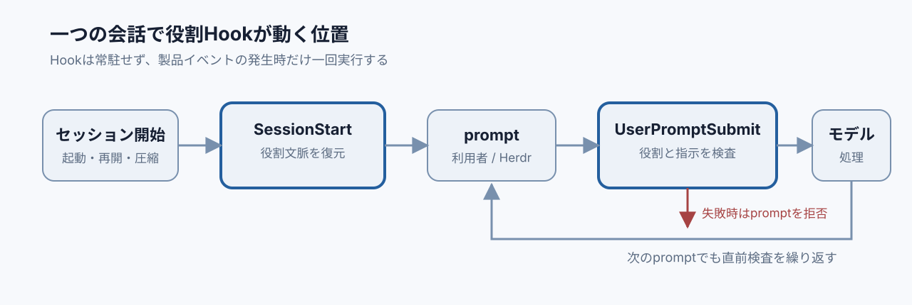
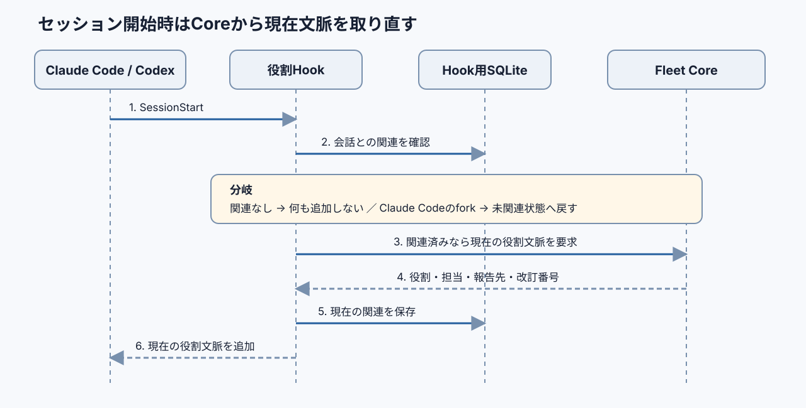
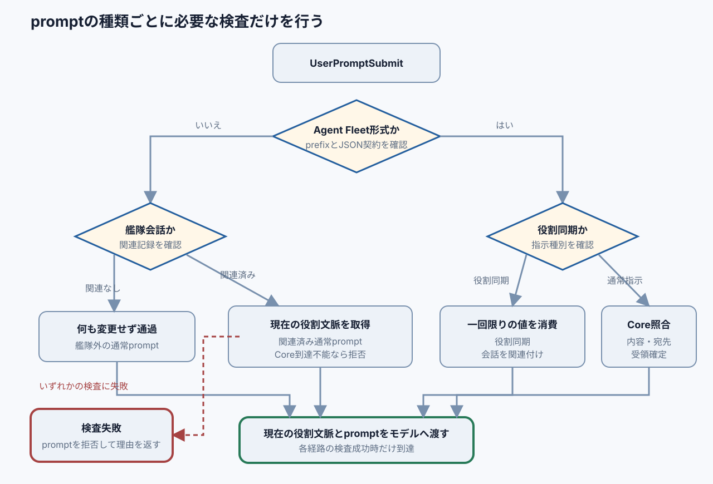

# エージェント艦隊における役割Hookの実行契機と責務

この資料は、役割Hookがいつ動き、何を確認し、どこまで作業開始を制御するかを説明する。

> 役割Hookはセッション開始時に役割文脈を復元し、prompt送信時に現在の役割と指示を検査する。Coreは、現在の役割改訂を確認できないメンバーへ通常指示を配送しない。

文書型: コンセプトドキュメント ／ 読み手: Agent Fleetを運用・保守する開発者

## 概要

**役割Hookには、セッション開始時とprompt送信時の二つの実行契機がある。** セッション開始時は会話へ現在の役割を戻す。prompt送信時は、モデルが入力を処理する前に役割と指示を検査する。

### この資料が扱う範囲

**この資料はHookの実行契機と責務だけを扱う。** 艦隊全体の配送、作業上の判断、性能基準は別資料を正本とする。

| この資料で説明すること | 別資料で説明すること |
|---|---|
| Hookが動くイベント | 指示と報告を配送する全体構成 |
| イベントごとの確認内容 | 誰が報告、要約、受容を行うか |
| Claude CodeとCodexの差 | 待ち時間と12秒上限の根拠 |
| Hook失敗時に止まる範囲 | 配送待ち指示と復旧方法 |

### 一つの会話でHookが動く位置

**役割Hookは常駐処理でも定期巡回でもない。** 製品が対象イベントを発生させたときだけ、固定配置された`role_context.py`を一回実行する。



*図1: SessionStartは会話の入口で一度動き、UserPromptSubmitは各promptの直前に動く。*

Hookはモデルの応答生成中には動かない。応答後にも専用Hookは登録していない。進捗の巡回や未配送指示の取得は、paneを持たない艦隊制御プロセスが担う。

### 実行契機の一覧

**二つの実行契機は、同じ役割文脈を異なる理由で確認する。** セッション開始時は失われた文脈を戻す。prompt送信時は、処理直前の文脈を最新化する。

| 実行契機 | いつ動くか | 主な役割 | 艦隊外の会話 |
|---|---|---|---|
| `SessionStart` | 起動、再開、初期化、圧縮の直後 | 現在の役割文脈をCoreから再取得して注入する | 関連記録がなければ何もしない |
| `SessionStart`の分岐 | Claude Codeで会話を分岐した直後 | 元会話の役割を無効にし、未関連状態へ戻す | 対象外 |
| `UserPromptSubmit` | 利用者またはHerdrのpromptをモデルへ渡す直前 | 現在の役割を確認し、艦隊指示をCoreと照合する | 関連記録がなければ何もしない |

Herdrが配送する役割同期、タスク指示、作業報告通知もpromptとしてpaneへ入る。このため、艦隊内の機械的な指示も`UserPromptSubmit`の検査を通る。

### セッション開始時に行うこと

**`SessionStart`は、会話に保存された役割をそのまま信用せず、Coreから現在情報を取り直す。** 起動、再開、初期化、圧縮で会話の見え方が変わっても、同じ役割改訂へ戻せる。



*図2: 艦隊へ関連付け済みの会話だけがCoreへ進み、Claude Codeの分岐会話は未関連状態へ戻る。*

Coreから戻す情報には、艦隊の目的、自身の役割、担当、完了条件、停止条件、報告先が含まれる。Hookは`context.sync`だけでは担当作業を開始しない規則も同時に注入する。

Claude Codeの分岐会話は、新しい会話として未関連状態へ戻す。元会話の役割を複製したまま作業すると、同じ論理メンバーが複数会話に現れるためである。Codexには現在、対応する分岐契機を登録していない。

### prompt送信時に行うこと

**`UserPromptSubmit`は、promptの種類に応じて確認経路を分ける。** 普通の入力は現在の役割を更新する。Agent Fleet形式の指示は、Coreに保存された正本との一致まで確認する。



*図3: 艦隊外の通常promptは通過させ、艦隊会話の現在文脈と機械的な指示だけを厳格に検査する。*

普通のpromptでも、艦隊へ関連付け済みの会話ではCoreへ現在の役割文脈を問い合わせる。担当変更によって改訂番号が進んだ場合は、新しい役割、担当、報告先をモデルへ渡す。

Agent Fleet形式の役割同期は、Coreが発行した一回限りの値を消費する。同じ会話を別艦隊や別メンバーへ無条件に付け替えることはできない。

通常指示は、指示ID、送信元、宛先、内容、受信会話をCoreの記録と照合する。Hookはローカルに受理準備を保存してから、Coreで受領を確定する。受領済みの同じ指示は二度目を拒否する。

### Claude CodeとCodexの差

**製品差はイベント名ではなく、分岐と開始失敗の扱いにある。** prompt送信時の指示検査と拒否は両製品で共通である。

| 項目 | Claude Code | Codex |
|---|---|---|
| `SessionStart` | `startup / resume / clear / compact / fork` | `startup / resume / clear / compact` |
| `UserPromptSubmit` | 毎回 | 毎回 |
| 会話の分岐 | 分岐した会話を未関連状態へ戻す | 対応する契機なし |
| 開始時の確認失敗 | 警告を追加する | セッション開始の継続停止を要求する |
| prompt時の確認失敗 | promptを拒否する | promptを拒否する |
| Hook信頼方針 | 製品側の設定に従う | `review`または`preapproved` |

Codexの`preapproved`はHookの信頼確認だけを省略する。tool承認とsandboxの方針は変更しない。`review`ではCodexによるHook内容の確認を残す。

### Hookが失敗したときの境界

**Hook単体ではなく、HookとCoreの配送制限を合わせて仕事開始を止める。** 特にClaude Codeでは、開始時Hookの警告だけで入力を完全に止められない場合がある。

| 失敗 | Hook側の結果 | Core側の結果 |
|---|---|---|
| 固定配置先の環境変数がない | 艦隊外の会話として何もしない | 有効な艦隊paneは`fleet-runtime`経由で起動し、固定配置先を必ず渡す |
| 現在の役割を取得できない | promptを拒否する。開始時は製品別の失敗結果を返す | 現在改訂の確認がないメンバーへ通常指示を配送しない |
| 役割改訂が古い | 新しい改訂を取得するまでpromptを処理しない | 古い確認を配送許可に使わない |
| 指示がCoreの記録と一致しない | 指示をモデルへ渡さない | 配送済みにしない |
| 同じ指示が再入力された | 二重受領として拒否する | 一度目の受領記録を維持する |
| Coreの受領確定後にローカル確定印を保存できない | 検査済み指示はモデルへ渡す | Coreの受領確定を正本として維持する |

この境界により、Hookが現在改訂を確認できない間は新しい通常指示が届かない。Hookが復旧して現在改訂を確認すると、Coreは通常指示の配送を再開できる。

**同じ利用者が艦隊paneの環境変数を手作業で除去する場合は安全境界の外である。** すでに現在改訂を確認済みの会話から環境変数だけを除去しても、Coreは除去を直接観測できない。有効な艦隊paneは`fleet-runtime`とHerdrから起動し、手動起動した会話を艦隊メンバーとして扱わない。

### 代表的な振る舞い

```gherkin
シナリオ: 再開した艦隊会話へ現在の役割文脈を戻す
  前提 会話Sは艦隊Fの作業者Wへ関連付け済みである
  かつ Coreの作業者Wの役割文脈は改訂番号3である
  もし 製品が会話SのresumeによるSessionStartを発生させる
  なら 役割HookはCoreから改訂番号3の役割文脈を取得する
  かつ 役割Hookは改訂番号3の役割文脈を会話Sへ追加する
```

```gherkin
シナリオ: 艦隊外の会話では通常promptへ介入しない
  前提 会話Sはどの艦隊メンバーにも関連付けられていない
  もし 利用者が会話Sで通常promptを送信する
  なら 役割HookはCoreへ役割文脈を要求しない
  かつ 役割Hookは通常promptを変更しない
```

```gherkin
シナリオ: 担当変更後の通常promptへ新しい役割文脈を追加する
  前提 会話Sは艦隊Fの作業者Wへ関連付け済みである
  かつ 会話Sが保持する役割文脈は改訂番号2である
  かつ Coreの作業者Wの役割文脈は改訂番号3である
  もし 作業者Wが会話Sで通常promptを送信する
  なら 役割HookはCoreから改訂番号3の役割文脈を取得する
  かつ 役割Hookは改訂番号3の役割文脈をpromptへ追加する
```

```gherkin
シナリオ: Coreと一致しない艦隊指示をモデルへ渡さない
  前提 会話Sは艦隊Fの作業者Wへ関連付け済みである
  かつ prompt内の指示内容はCoreに保存された指示内容と一致しない
  もし Herdrが会話Sへそのpromptを送信する
  なら 役割Hookはpromptを拒否する
  かつ Coreはその指示を配送済みにしない
```

```gherkin
シナリオ: Claude Codeの分岐会話へ元の担当を引き継がない
  前提 Claude Codeの会話Sは艦隊Fの作業者Wへ関連付け済みである
  もし 利用者が会話Sから会話Tを分岐する
  なら 役割Hookは会話Tを未関連状態として記録する
  かつ 会話Tは新しい役割同期を受けるまで艦隊Fの担当作業を開始しない
```

## なぜこうなっているか

**セッション開始時だけでは、長く続く会話の担当変更をprompt処理前に反映できない。** prompt送信時だけでは、再開や圧縮の直後にモデルが古い文脈を前提として応答する余地が残る。二つの実行契機を使うことで、復元と直前検査を分けている。

### 実行契機ごとに役割を一つへ絞る

**`SessionStart`は復元、`UserPromptSubmit`は検査を主責務とする。** 両方がCoreから現在文脈を取得する場合でも、発生理由が異なる。

| 構成要素 | 担うこと | 担わないこと |
|---|---|---|
| `hooks.json` | 実行イベントと短い起動宣言 | 役割同期、Core照合、ファイル探索 |
| 固定版`role_context.py` | 会話との関連、役割注入、指示照合、prompt拒否 | 配送巡回、タスク完了判断 |
| Hook用SQLite | 会話との関連、受理準備、補助的な受領印 | 役割、担当、タスクの正本 |
| Fleet Core | 現在の役割、改訂番号、指示、受領の正本 | 製品イベントの処理、pane操作 |
| 艦隊制御プロセス | 配送対象の取得とHerdrへの送信 | 会話内の役割注入 |
| マネージャー | 報告の意味づけ、次の指示、受容判断 | Hook実行、SQLite巡回 |

この分担により、Hookはモデルの入口を守り、Coreは艦隊状態の入口を守る。どちらか一方へ全責務を集めず、会話と論理状態の境界を保っている。

### 起動中のHookを固定する

**艦隊paneは起動時に固定配置されたHookを使い続ける。** プラグインキャッシュの版が削除されても、起動済み会話の実行先を失わないためである。

`fleet-runtime`は、役割Hookを内容ハッシュ別の艦隊状態領域へ複製する。起動時と再開時には、保存済みハッシュ、所有者、書き込み権限を検査する。停止後の再起動で初めて、新しいプラグインのHookへ切り替える。

## 採らなかった選択肢

| 選択肢 | なぜ採らなかったか |
|---|---|
| セッション開始時だけ確認する | 担当変更後の通常promptを古い役割で処理できてしまう |
| prompt送信時だけ確認する | 再開や圧縮直後の役割復元をprompt到着まで遅らせる |
| Hookが定期的にCoreを巡回する | paneごとに常駐処理が増え、艦隊制御プロセスと責務が重なる |
| `AGENTS.md`や`CLAUDE.md`へ現在担当を書く | 担当変更のたびに静的ファイルを書き換え、会話ごとの改訂を確認できない |
| `hooks.json`へ実処理を埋め込む | 処理がイベントごとに複製され、単体試験と更新が難しくなる |
| Hookだけで仕事開始を保証する | 製品ごとに開始時失敗の扱いが異なり、配送側の安全条件が残らない |

## 関連コンセプト

- [作業進行ルール](2026-08-31-エージェント艦隊-作業進行ルール.md) — 役割文脈に含める責務と報告先
- [艦隊制御アーキテクチャ](2026-08-31-エージェント艦隊-連携と全体制御.md) — Hook、Core、艦隊制御プロセス、Herdrの全体関係
- [非機能要件](2026-08-31-エージェント艦隊-非機能要件.md) — Hookの通常時目標と12秒上限

## その他の情報

- [Claude Code用Hook設定](../plugins/agent-fleet-herdr/hooks/claude-hooks.json) — Claude Codeのイベント登録
- [Codex用Hook設定](../plugins/agent-fleet-herdr/hooks/codex-hooks.json) — Codexのイベント登録
- [役割Hookの実処理](../plugins/agent-fleet-herdr/hooks/role_context.py) — 本資料で説明した現在の実装
- [Hookの単体試験](../plugins/agent-fleet-herdr/adapter/tests/test_role_context_hook.py) — 実行契機ごとの成功・拒否・復旧条件
